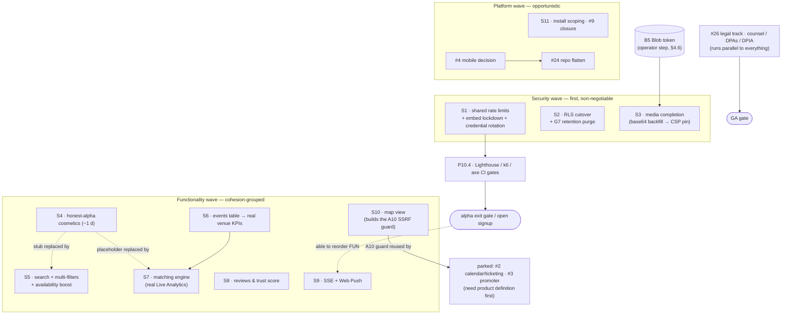
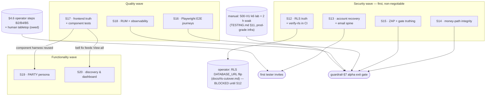

# DEV_TIMELINE — AfterDark

> Living status document. **Update the "Current status" block and phase checkboxes whenever a
> slice lands.** Companion to [CLAUDE.md](CLAUDE.md) (architecture & audit) and
> [TENANT_GUARDRAIL.md](TENANT_GUARDRAIL.md) (compliance & performance gates).

---

## 1. Current status — YOU ARE HERE

- **Date:** 2026-08-18 (night) · **S15 gate calibration — both new gates fired on first
  contact, and both finds were real** (879 tests green):
  - **k6** crossed the pooled Apdex threshold while *every* functional assertion passed
    (301/301 checks, 0 errors). Cause: S15's own apply-spike added a WRITE class to a
    metric whose T was calibrated on a read-only mix — reads decomposed to ≈0.90 (exactly
    the old calibration), writes to ≈0.5. **Fixed by scoring Apdex per transaction class**
    (as Apdex is specified), not by raising the single T — which would have blunted the
    read tripwire to hide a write cost.
  - **ZAP** found 3 Mediums, all genuine, all fixed rather than accepted: an **unused
    FontAwesome Pro stylesheet proxied first-party** (leaking every visitor's IP + a kit
    token since the create.xyz export), the **`img-src https:` wildcard** that let dev/CI
    diverge from production and was hiding a **hotlinked landing texture destined to break
    the moment B5 lands**, and **HTML 404s served with no CSP** (extension-based matcher).
    Details + the one accepted risk in §7.3 S15.
- **Date:** 2026-08-18 (evening) · **Branch:** `claude/s15-gate-truthing` (off `main`,
  which now truly contains S12–S14 — verified by content after the #24/#25 merges) —
  **S15 landed: DAST & gate truthing** (875 tests green; typecheck/lint/build clean;
  details in §7.3 S15). The `alpha-gates` job gains **Gate 4: a ZAP baseline** enforcing
  0 unaccepted High/Medium via `scripts/zap-gate.mjs` (accepted risks named in-script;
  seeded with the deliberate `style-src 'unsafe-inline'`) and the **zero-inline-media
  gate** (`db:backfill-media --verify` per PR). Two new machine-checked registries:
  **audit coverage** (mutating routes declare audited-or-exempt-with-reason; forced the
  stripe/webhook + upload audit retrofits) and the **stored-XSS structural gate**
  (`dangerouslySetInnerHTML` allowlist proven style-only). k6 gains the p99<4×T
  threshold, the §3.4 #2 apply-spike scenario, and a hard-fail (not silent-skip) setup.
  **The §7.2 E doc-drift list is empty** — incl. the TESTING.md §8 known-gaps rewrite,
  half of which predated S1–S14. First CI run of Gate 4 is the live ZAP calibration:
  watch the S15 PR's checks; new unaccepted findings get fixed or explicitly accepted
  in-script, in review.
- **Date:** 2026-08-18 (later still) · **Branch:** `claude/s14-money-path` — **S14 landed:
  money-path integrity** (867 tests green — 38 new route tests; typecheck/lint/build
  clean; details in §7.3 S14). The money paths finally have route-level proof:
  payouts/release (double-release, privilege, unkeyed ledger-advance, transfer modes),
  stripe/webhook (signature/replay — the guardrail-§7 box closes), shifts idempotency +
  the explicit fee-tamper test, upload, DSR confirm gates, age-confirm. A3: both
  dashboards now label simulated money ("Simulated — payments not live"). A5: dark crons
  scream (log + Sentry), every scheduled run heartbeats, and the admin dashboard shows
  per-job cron health with staleness. *Merge-order note:* S13 (#23) was found stranded on
  the base branch again — corrective PR opened (**merge it with "Delete branch" checked**,
  which is what breaks this cycle); S14 is stacked on it.
- **Date:** 2026-08-18 (later) · **Branch:** `claude/s13-account-recovery` — **S13 landed:
  account recovery & email spine** (829 tests green; typecheck/lint/build clean; the three
  new page states browser-verified; details in §7.3 S13). Key-gated Resend transport
  (`api/utils/email.ts`, no SDK dep) + testable handlers (`lib/auth-email.ts`) + additive
  `auth.ts` config: password reset (single-use 1 h tokens, session revocation, audited,
  rate-limited, uniform no-enumeration responses), forgot/reset pages + sign-in link,
  email verification enforced-when-keyed with the 0021 grandfather migration, 2FA
  backup-code recovery copy at enroll. **Operator:** set `RESEND_API_KEY` + `EMAIL_FROM`
  (§6) to activate delivery. *Also this session:* discovered the stacked S12 PR (#21) had
  merged into its base branch but **never reached `main`** — corrective PR opened landing
  `claude/alpha-missing-features-84e9eb` (= S12) into main; S13 is stacked on it.
- **Date:** 2026-08-18 · **Branch:** `claude/s12-rls-truth` (stacked on the §7 analysis
  branch) — **S12 landed: RLS truth & cutover unblock** (812 tests green; typecheck, lint,
  build clean; details in §7.3 S12):
  - The three bare-`sql` gaps wired through `withRlsContext` — `/api/stream` (SSE
    fingerprint), `/api/gigs/match-preview` (atomic 3-query batch), and `/api/user/role`
    (profile writes — a third instance the S12 sweep itself found; onboarding would have
    500'd post-cutover).
  - The invariant is now machine-checked: `test/rls-wiring.test.ts` (registry-style, like
    the authZ matrix — governed tables derived from the migrations, builder refs
    attributed to executing routes, per-mode invariants). `rls.ts` and the new CI driver
    are unit-tested.
  - `yarn db:verify-rls` grew 19 → **23 checks** (S12 wiring canaries) and now runs as
    **Gate 0 of the CI `alpha-gates` job** on every PR, as a provisioned non-owner role
    over the credential-faithful WebSocket tunnel — RLS enforcement is no longer a
    manual-only proof.
  - `docs/rls-cutover.md` corrected (its "wiring complete" claim was false); **the
    operator `DATABASE_URL` flip is re-opened once this merges.**
  - Slice-verification note: S1–S11 were re-confirmed complete first (per the §7 audit,
    only documented operator steps remain), which is why work proceeded to S12.
- **Date:** 2026-08-17 · **Branch:** `claude/alpha-missing-features-84e9eb` — **alpha gap
  analysis, recorded as §7.** Full code audit of missing features/functionality vs the alpha
  definition, assessed at `4e8f0ab` (= `main`; nothing landed since the 2026-08-03 merge of
  PR #18). Baseline re-verified, not read off status notes: 791/791 tests, typecheck and
  lint clean. Headline findings, each with file:line evidence in §7.2:
  - **The RLS route wiring is NOT complete** — `/api/stream` and `/api/gigs/match-preview`
    run bare `sql` on governed tables, so the operator `DATABASE_URL` flip is **blocked
    until S12** (flipping today silently kills SSE realtime). `docs/rls-cutover.md`'s
    "wiring complete" claim is false.
  - **No password reset and no email infrastructure exist** — a tester who forgets their
    password is permanently locked out (worse with 2FA), and `requireEmailVerification:
    false` lets anyone sign up with someone else's address (S13).
  - **Simulated money renders as real earnings** — with Stripe unkeyed, payout release
    advances the ledger to RELEASED and dashboards show it as earned (S14).
  - **The verification layer under-delivers its own bar**: zero frontend/component tests,
    zero Playwright E2E, no ZAP/DAST, no RUM, no stored-XSS suite, money-path routes
    (payouts/release, stripe/webhook, shifts idempotency) have zero route tests, and the
    CI k6 gate runs at T=1600 ms while the docs still claim T=300 (S14–S18).
  - **The PARTY persona is complete and tested server-side but unreachable in the UI** —
    signup writes a dead `'PERSONAL'` sentinel, `/dashboard` 404s for everyone (no root
    router), and no venue directory / inquiry path / PARTY messages surface exists (S19).
  - Assorted tester-facing breakage: dead notification bells on both dashboard homes,
    draft-duplicating Save Draft, ephemeral Saved Talent, dead Preview / Talk-to-Sales
    buttons, page-scoped browse search (S17/S20).
  Everything is inventoried and sliced as **S12–S20 in §7 — security wave first, then
  quality, then functionality**.
- **Date:** 2026-07-31 (late) · **Branch:** `claude/backlog-slices-4-10-b73087` (worktree
  off `main`; S1–S3 merged in PR #15)
- **P10.4 + S11 delivered this session (2026-07-31 — §5 is now fully landed except the
  externally-parked items):**
  - **P10.4 alpha exit gates, all in CI** (`alpha-gates` job): self-contained — vanilla
    Postgres + the local Neon-protocol proxy sidecar (opt-in `NEON_LOCAL_PROXY=1`,
    `api/utils/neon-local.ts`) stand in for Neon, so CI holds **zero DB secrets**; the
    app is migrated + seeded + built + served per run. Gate 1: **axe smoke** over the 10
    wireframe screens (fails on `critical`; `serious` warns until the #13 deep pass) —
    running it found and fixed 13 unnamed controls (bells, month-nav chevrons, switches,
    the role select, venue drill-ins) + 2 unnamed progress bars. Gate 2: **Lighthouse**
    §3.2 budgets over the 5 target URLs in 3 passes (public/talent/venue, session cookie
    via extraHeaders); CLS/TTFB/image-weight/a11y-score enforce, LCP/TBT/FCP/JS-weight
    warn until the RSC refactor §3.2 itself predicts (levels documented in
    lighthouserc.cjs) — the gate immediately caught the create.xyz-hosted hero image
    (~budget-blowing AND already blocked by the S3 CSP pin in prod); replaced with a
    deterministic self-hosted 11 KB webp. Gate 3: **k6** — §3.4 scenario shapes at smoke
    scale (browse surge, message poll fan-out, fixed-key check-in double-tap) asserting
    **Apdex ≥ 0.85 @ T=300 ms** and error rate <1%; the full 500-VU/15-min/soak lab
    stays a pre-release manual procedure (TESTING.md §11).
  - **S11 deploy & repo hygiene:** #23 `installCommand: yarn workspaces focus web` in
    vercel.json (this PR's Vercel preview is the verify-before-adopt step); #4 decided —
    **PWA-first, Expo deferred** (`docs/mobile-decision.md`, with revisit triggers);
    #24 flatten disposition: PWA-only shape, executed as an operator-coordinated change
    (Root Directory dashboard flip must land in the same window — plan in the ADR);
    #9 closed as moot-on-Vercel (decision note in `publisher/open-next.config.ts`).
- **Functionality wave S4–S10 delivered this session (2026-07-31 — closes Backlog #1,
  #5, #6, #7, #8 core, #14, #27, #28; 791 tests green; migrations 0015–0020 applied to a
  disposable Neon branch off prod and the loop browser-verified end-to-end):**
  - **S4 honest-alpha cosmetics**: venue Gig Calendar real (was a hardcoded mock month),
    mock Live Analytics labeled (interim), dead Analytics sidebar link removed, fake
    auto-saved text real, `/account/suspended` surface + AuthGuard-aware `/api/session`
    (403 + reason) + sidebar redirect (settings exempt so GDPR self-service stays open).
  - **S5 search & discovery**: `/api/search` Postgres FTS (plainto_tsquery only, public
    columns, rate-limited; 0015 GIN indexes) + GlobalSearch dropdown (landing/sidebar/
    drawer) + URL-addressable `/search`; multi-value browse filters as CSV → `LIKE ANY`
    (#27); availability boost in talent ordering (#28) via the 0017 definer probe.
  - **S6 events & KPIs**: append-only `events` (0016, RLS in-file, REVOKE UPDATE/DELETE,
    no PII) + `track()`; emitters on publish/fill/cancel/apply; `/api/venue/stats` powers
    real Avg-Time-to-Hire + Filling-Rate trends on the venue dashboard.
  - **S7 matching engine**: `/api/gigs/match-preview` — real Live Analysis (counts ×
    role/rate/availability, top-4 public cards w/ transparent score, pricing percentiles);
    availability yes/no ONLY via `app_talent_available_on` SECURITY DEFINER (0017) so the
    private calendar never leaks and the S5 boost survives the RLS cutover.
  - **S8 trust & reviews**: `reviews` shift-scoped one-per-direction (0018), POST gated to
    real counterparties post-CHECKED_OUT w/ server-derived direction; venue rating +
    talent trust score v1 recomputed server-side under SERVICE context; ReviewDialog on
    both dashboards; ★/Trust badges in the directory; reports accept `review`;
    `docs/id-verification.md` ADR (Stripe Identity, post-alpha).
  - **S9 realtime & push**: `/api/stream` SSE (per-connection auth, ≤50 s windows,
    KEYS-ONLY invalidate frames) + RealtimeInvalidator behind the existing TanStack keys;
    Web Push opt-in (0019, VAPID-key-gated, id-only payloads, capped fan-out, sw.js
    push/notificationclick handlers that never fetch/cache).
  - **S10 map + A10 guard**: `safe-fetch.ts` SSRF guard (allowlist, private-range deny incl.
    169.254.169.254, no redirects, timeout+size caps — #2 integrations must reuse it);
    Nominatim geocode-on-publish (0020 lat/lng, server-written only); GigsMap
    (MapLibre + OSM, escaped popups); CSP pins tile origin, worker-src gains blob:.
  - **Found & fixed while verifying live**: onboarding 400 for anyone skipping the
    sub-role chip (schema `optional()` vs posted `null` — pre-existing); Live Analysis
    showing 0 for "DJ / Producer" gigs vs "DJ" profiles (role match now bidirectional).
- **Previous status (2026-07-31, alpha punch-list session):**
- **Date:** 2026-07-31 · **Branch:** `claude/alpha-punchlist-pwa` (worktree off `main`;
  PRs #7–#12 merged, #13 = the §4 readiness assessment)
- **Project stage:** **P0–P9 complete + P10.1–P10.2 (PWA install surface).** Remaining
  before the formal alpha exit gate: **P10.3** (shared rate-limit store), **P10.4** (CWV/
  k6/axe CI gates), and the **§4.6 ops activation** (Sentry DSN, `CRON_SECRET`, Blob token
  — ~10 min in the Vercel dashboard).
- **Alpha punch-list delivered this session (2026-07-31 — closes §4.3):**
  - **B1 CI restored**: deleted `anything/.eslintignore` (create.xyz leftover containing
    `*`) — oxlint had linted **zero files** since the lint step was added in PR #8, exiting
    1 and skipping vitest + build on every `main` merge. Lint now sees real files (0
    warnings); 606 tests green locally.
  - **B6 PWA (P10.1 + P10.2)**: `manifest.webmanifest` + deterministic icon set
    (`yarn pwa:icons`, sharp-rendered crescent mark, maskable + apple-touch);
    dependency-free `public/sw.js` enforcing §6.6 (never intercepts `/api`, navigations
    network-only w/ offline fallback page, `/_next/static` cache-first, `PURGE_CACHES`);
    registration in `Providers` (production-only), **cache purge wired into logout**;
    `worker-src 'self'` added to the CSP (strict-dynamic ignores host sources); 22 new
    tests incl. a sandbox harness driving the real worker file. Manual: TESTING.md §9.
  - **B7 incident runbook**: `docs/incident-runbook.md` v1.0 (P1–P4 classes, 72 h drill,
    contact tree, tabletop script + log w/ desk-check run recorded; human tabletop owed
    before first invite) + legal-hold section added to `docs/retention.md` §5.
  - **B3 payments briefing**: verbatim tester briefing in TESTING.md §2.1 (payouts
    simulated, no real payment data); Stripe test keys stay optional (§4.6 step 4).
  - **B2/B4/B5 prepared as operator steps** — exact 10-minute runbook in **§4.6** (they
    involve provisioning/pasting secrets, which stays out of agent hands by design).
  - **Discovered & fixed while watching this PR's CI: every Vercel deploy since the P3–P8
    merge (`aa94e60`, 2026-07-30 23:56) had been failing** — production was serving the
    P2-era build. Cause: P8's `vercel.json` declared an **hourly** cron, which Hobby-plan
    Vercel rejects at deploy time (GitHub CI never reads `vercel.json`, so its build stayed
    green — and §4.2's assessment missed it for the same reason: deploy status lives only
    in Vercel/commit statuses). Rescheduled to daily 09:00 UTC (§4.6 cron note); restore
    hourly on Pro.
- **P9 delivered this session** (583 tests green; the whole moderation loop executed live
  against a Neon branch and browser-verified; migration 0012 + the admin preview account
  applied to production):
  - **P9.1 Admin gating + reports triage**: migration `0012_admin_trust.sql`
    (`user.suspended_at/-reason`, report `reviewed_by/-at/resolution_note`, triage indexes).
    `GET/PATCH /api/admin/reports[/[id]]` — queue is open-first/HIGH-first; transitions
    OPEN→REVIEWING→CLOSED are optimistic-concurrency-guarded, audited, and CLOSED is
    terminal. **Reading a reported conversation's messages writes an
    `admin.moderation.messages_read` audit event** (the security gate's "admin reads of
    private messages are logged" requirement, verified live).
  - **Suspension is enforced in AuthGuard**, not per-route: any non-NULL `suspended_at`
    turns every authenticated request into a 403 carrying the reason, effective on the
    target's next request (the guard reads the row per request — no session dance). The
    single deliberate carve-out: `allowSuspended` on the two GDPR self-service routes —
    **data-subject rights survive moderation** (suspended export verified 200 while every
    other call 403'd). `optionalUser` treats suspended as signed-out, so no owner extras.
  - **P9.2 User & gig management**: `GET /api/admin/users` (search/role/flagged, report
    counts) + `PATCH /api/admin/users/[id]` suspend/unsuspend with guardrails — no
    self-suspension, no suspending ADMINs (de-escalate out-of-band first), reason required.
    `GET /api/admin/gigs` (cross-tenant view w/ applicant + report pressure) +
    `PATCH /api/admin/gigs/[id]` **takedown → CANCELLED only** (zod literal — an admin
    cannot publish or edit a venue's gig), idempotent, audited, venue notified with reason.
  - **P9.2 Audit viewer + export**: `GET /api/admin/audit-logs` (filters, 50/page) and
    `?format=csv` — RFC-4180-escaped, **bounded at 10k newest rows so the handler stays
    <1s** instead of an async job (documented trade-off); every export is itself audited.
  - **KPI overview** `GET /api/admin/overview`: users by role + suspended, reports by
    status/severity, gigs by status, payout ledger totals, live-shift count, Stripe
    configured flag — wireframe p1's cards from real aggregates.
  - **Admin UI** `/dashboard/admin` (wireframe p1, one dense screen): KPI cards, Reports
    Triage (severity chips, Review/Close), User & Gig Management (tabs, search, flagged
    filter, suspend/reinstate/take-down), live Audit Log rail, Export Audit Log button.
    `DashboardSidebar` gained the `admin` variant; a non-admin who reaches the page gets a
    clean "Admin access required" card (the APIs are the real gate).
  - **AuthZ matrix**: 8 new ADMIN_ONLY rows (274 generated tests); admin preview account
    (`admin.preview@afterdark.dev`) added to the out-of-band provisioning script — which
    revealed the script never created the 4th account (destructure bug, fixed).
  - **Bugs found while verifying**: better-auth's `user` table is camelCase (`"createdAt"`)
    — two admin queries 500'd until quoted; the preview-accounts script silently skipped
    the admin entry.
- **P3–P8 delivered this session** (520 tests green; the whole loop executed against a Neon
  branch — API-level with curl and visually in the browser — procedures in
  [TESTING.md](TESTING.md); migrations 0007–0011 applied to the production branch):
  - **P3 Applications + notifications**: `0007_applications.sql` (unique `(gig_id,
    talent_id)`, `proposed_rate_cents` INTEGER, statuses PENDING|SHORTLISTED|HIRED|REJECTED|
    WITHDRAWN, RLS policies in-file per the P2.4 convention — all five new migrations follow
    it). `POST /api/gigs/[id]/apply` (TALENT-only, PUBLISHED-only, revives a WITHDRAWN row);
    `PATCH /api/applications/[id]` runs an actor-scoped transition matrix
    (`application-lifecycle.ts`) and **hire is one `sql.transaction`**: application→HIRED +
    gig→FILLED + shift INSERT (agreed rate = accepted proposal, else base rate — snapshotted
    in cents). Venue applicants page + talent My Applications + gig-detail apply panel all
    real; `notifications` table + bell dropdown + real sidebar unread badges (Backlog #12 ✅);
    messages/shifts/payouts emit through one `notify()` helper.
  - **P4 Media pipeline**: `api/utils/media.ts` — every uploaded image is decoded and
    **re-encoded via sharp (EXIF/GPS stripped — G11), resized ≤1600px, webp**; stored to
    Vercel Blob when `BLOB_READ_WRITE_TOKEN` is set, else kept inline as a processed data
    URL (dev fallback). Wired into talent/venue profile writes, settings avatar, message
    attachments, and a generic `POST /api/upload`. S3 presign + backfill deferred (Backlog).
  - **P5 Messaging & negotiation**: `0008_messaging.sql` (conversations GIG|PARTY_INQUIRY
    kinds + unique partial indexes; messages TEXT|RATE_PROPOSAL|SYSTEM with `rate_cents`;
    reports). Participant-scoped reads; venue user ids resolved server-side from the gig so
    they never transit the client. Shared two-pane `MessagesView` (5s polling, unread marks,
    attachment→data-URL through P4, propose-rate popover, gig-in-focus rail, report→
    `reports`). **Accept-rate writes the agreed rate onto the application** and drops a
    SYSTEM message into the thread.
  - **P6 Availability**: `0009_availability.sql` (3 slots/day, unique `(talent_id, date,
    time_slot)`) + `available_tonight` on talent_profiles. `GET/PUT /api/availability`
    (month-scoped, per-slot upsert/delete in one transaction) powering the rebuilt calendar
    (month grid with status dots, conflict = shift over a blocked day, slot editor rail,
    Available Tonight toggle → profile PUT).
  - **P7 Live ops / shifts**: `0010_shifts.sql` (+`shift_transitions` idempotency table).
    `POST /api/shifts/[id]` — actor-scoped matrix (`shift-lifecycle.ts`), **idempotency keys
    backed by a DB unique constraint**: replaying a key returns the recorded outcome without
    re-running the transition (verified live). Checkout computes `shift_pay_cents` from
    actual check-in/out timestamps and **creates the payout ledger row (HELD)** via
    server-side `splitPayout`. Venue dashboard Active Operations rail and talent Upcoming
    Bookings (On My Way / Check In / Check Out) are real; both dashboards' stats now derive
    from live rows.
  - **P8 Payments (key-gated)**: `0011_payments.sql` — `payouts` append-only ledger (integer
    cents, `CHECK (gross = fee + net)`, user FKs `ON DELETE SET NULL` for the 7-year
    financial carve-out), `stripe_accounts`, `stripe_events` (PK = event id → replay guard).
    `stripe.ts` is **key-gated**: without `STRIPE_SECRET_KEY` the `/api/stripe/*` surface
    returns 503/`configured:false` and the ledger still advances so the loop stays
    demonstrable. With keys: Connect Express onboarding, webhook with
    `constructEventAsync` signature verification + replay drop, transfers on release.
    `POST|GET /api/payouts/release` releases HELD→RELEASED **only 24h after checkout**,
    exactly once (`WHERE status='HELD'`), flips shifts→PAID, notifies; callable by ADMIN
    session or `CRON_SECRET` bearer — `vercel.json` schedules it (Vercel Cron invokes with
    GET + the bearer). *(Shipped hourly; rescheduled to daily 2026-07-31 — the hourly cron
    was failing every Vercel deploy on the Hobby plan, see §4.6's cron note.)*
  - **AuthZ matrix grew with the surface** (P2.3 paying off): ~21 new rows, new
    `UNAVAILABLE` outcome for the key-gated Stripe start, and the generated suite now
    contributes 231 tests; the coverage gate kept every new route declared.
  - **Bugs found while verifying (fixed + regression-tested)**: (1) hiring flips a gig to
    FILLED, which made the hired talent's own deep links 404 — gig detail now stays visible
    to a talent with an application on it (anon still 404s); (2) partial profile PUTs (e.g.
    the Available Tonight toggle) recomputed completion % from the request body alone and
    clobbered the stored value to 0 — now merged over the stored row; (3) the app never set
    the `dark` class, so every shadcn semantic token resolved to the light palette (outline
    buttons rendered white-on-white) — root layout now pins `<html class="dark">`; (4) venue
    Open Gigs "Applicants" column showed a placeholder dash — now real counts with a
    pending-count chip.
- **P2 delivered this session** (373 tests green; browser- and database-verified, procedures in
  [TESTING.md](TESTING.md)):
  - **P2.1 Legal surface (G1/G3)**: `/legal/privacy`, `/legal/terms`, `/contact` — real,
    versioned, dated, reachable logged-out; content matches what the code actually does
    (including "payments are not live"). Version/date and contact addresses come from
    `src/lib/legal.ts`. Every footer `href="#"` is gone. Cookie audit confirms **no
    `Set-Cookie` on logged-out pages** — no consent banner is needed while that holds.
  - **P2.2 Self-serve DSR (G4)**: `GET /api/account/export` (JSON download, rate-limited 5/h,
    `no-store`, audited, credentials deliberately excluded and *named* in `meta.excluded`) and
    `DELETE /api/account` (password re-auth **plus** typed `DELETE`, cascade, audit-trail
    pseudonymization). Both read **one registry** — `api/utils/account-data.ts` — so export and
    erasure cannot drift apart; later slices add their table there once.
  - **P2.3 AuthZ matrix (§6.1)**: `api/utils/authz-matrix.ts` declares every route × actor ×
    ownership; the generated suite contributes **112 tests** and **fails CI when a `route.ts`
    has no row** (and when a row points at a deleted route). Writing it surfaced two wrong
    assumptions in my own spec — `/api/session` 401s rather than returning null, and a rival's
    *published* gig is public by design, so the isolation test now runs against a DRAFT.
  - **P2.4 RLS**: GRANTs migration (`0006`, least-privilege, `audit_logs` INSERT/SELECT only,
    no DDL) + **`yarn db:verify-rls`, which proved the 0004 policies actually enforce against
    a real non-owner role — 10/10** (drafts invisible by direct id, cross-tenant UPDATE affects
    0 rows, audit trail immutable). Nobody had ever tested them against an enforcing role.
    **The production cutover is deliberately NOT done** — see the "honest status" note below.
  - **P2.5 Age gate + governance (G12/G2/G7)**: 18+ attestation at signup recorded server-side
    (`age_confirmed_at`, idempotent — first attestation wins); per-gig `age_requirement`
    (18/21, DB CHECK + zod) now persisted by the create-gig wizard and surfaced as a **21+ ONLY**
    badge on the detail page. `docs/ropa.md` and `docs/retention.md` written, including a
    candid "known gaps" table.
  - **Security bug found and fixed while verifying**: a **deleted account's session kept
    working**. better-auth caches the session in the cookie for 7 days, so `getSession`
    succeeded after erasure and the user could still call authenticated endpoints. `AuthGuard`
    now confirms the user row exists on every authenticated request (one indexed lookup, and
    it replaces the query `requireRole` already made). This also fixes stale sessions after a
    database swap, and pre-wires account suspension for P9.
- **P0/P1 close-out (second pass, same day):**
  - **2FA → better-auth twoFactor plugin (Backlog #17 ✅)**: migration `0005` (plugin
    `twoFactor` table + `user.twoFactorEnabled`, legacy hand-rolled enrollments cleared);
    plugin registered in `auth.ts` (+ rate limits on its endpoints); `twoFactorClient` in
    `auth-client.ts` with a callbackUrl-preserving challenge redirect; new
    `/account/two-factor` challenge page (TOTP + one-time backup codes + trust-device);
    settings 2FA card rebuilt on the plugin (password-gated enable/disable, local QR, backup
    codes); legacy `/api/settings/2fa` + `totp.ts`/`crypto-box.ts` removed —
    **`AUTH_SECRET_ENCRYPTION_KEY` is obsolete** (BETTER_AUTH_SECRET now encrypts
    enrollments; rotating it invalidates them). Sign-in is now genuinely gated (the old 2FA
    never challenged at sign-in). **Full loop browser-verified** (enroll → challenge → TOTP →
    backup code → disable); tests 245 green (hand-rolled TOTP/SecretBox suites retired with
    their code).
  - **oxlint in CI (Backlog #20 ✅)**: `yarn lint` (deny-warnings) + CI job; 4 pre-existing
    warnings fixed.
  - **Bug found & fixed while verifying**: `/dashboard/settings` never hydrated on clean
    loads (its `useSearchParams`+`Suspense` wrapper stayed suspended forever under the
    nonce-CSP/force-dynamic setup — form rendered but dead, values never loaded, predating
    today). Role param now read post-mount; page hydrates and populates. TESTING.md §5 has
    the canary check.
- **P1 delivered this session** (285 tests green; verified in-browser against a Neon branch,
  procedures now codified in [TESTING.md](TESTING.md)):
  - **P1.1** Talent browse consumes real `GET /api/gigs` (validated filters, 12/page
    pagination via parameterized LIMIT/OFFSET, HOT/NEW badges derived from data); venue
    browse consumes a new public `GET /api/talent` directory (public-profile columns only).
    `MOCK_GIGS`/`MOCK_TALENT` deleted. `tonightOnly` fixed to a rolling 24h window (the old
    UTC-date match dropped late-night gigs).
  - **P1.2** `/gigs/[id]` detail page (payout hero w/ computed shift payout, about, venue
    card, live 5% fee estimator, escrow note; map deferred) + `GET /api/gigs/[id]` —
    PUBLISHED is public, any other status 404s for non-owners (draft-leak safe).
  - **P1.3** Gig lifecycle DRAFT→PUBLISHED→FILLED→COMPLETED/CANCELLED (`0003_gig_lifecycle.sql`
    + pure transition matrix in `api/utils/gig-lifecycle.ts`); owner-only idempotent
    `PATCH /api/gigs/[id]` (audited, optimistic-concurrency guarded); venue dashboard Open
    Gigs table real via `GET /api/venue/gigs`, with per-status action buttons and real
    Active-Gigs/Filling-Rate stats (payout/time-to-hire stats honestly muted until P8/P3).
  - **P1.4** Landing "Hot Gigs Tonight" reads real published gigs (tonight-first, upcoming
    fallback, friendly empty state) via a `FeaturedTonight` client component.
  - **P0 follow-ups**: **nonce CSP** shipped (per-request nonce + `strict-dynamic` via
    middleware; `unsafe-inline` dropped from script-src; app now renders fully dynamic —
    `force-dynamic` in the root layout is a hard requirement of nonce CSPs). **Sentry**
    wired (`@sentry/nextjs`, no-op without DSN, all events pass a tested PII scrubber).
    **RLS** policies shipped dormant (`0004_rls.sql` + `api/utils/rls.ts`; activation is an
    ops step — see migration header). **twoFactor plugin migration deliberately deferred**
    → Backlog #17 (rationale there).
  - Hygiene: off-spec talent create-gig page removed (Backlog #11 ✅); sidebar now shows the
    real session identity and fake unread badges are gone (Backlog #12 partial).
  - **Ops**: production Neon DB (`after-dark` project) migrated 0001–0004 and seeded with the
    three shared preview accounts (talent/venue/party — credentials in TESTING.md §2);
    sign-in verified against the deployed site.
- Baseline: create.xyz export in `anything/` + the three audit docs (merged/PR'd earlier).
- **P0 delivered this session** (all security findings CLAUDE.md §7 #1–#9 addressed):
  - **Migrations**: `apps/web/migrations/0001_baseline.sql` (reproduces §6.1) + `0002_audit_logs.sql`;
    idempotent runner `scripts/migrate.mjs` (`yarn db:migrate`) + demo seed `scripts/seed.ts`
    (`yarn db:seed`); `.env.example`. **Verified end-to-end against a disposable Neon branch.**
  - **RBAC + authN gate**: `src/middleware.ts` (session gate on `/dashboard/*` + `/onboarding`)
    and a DB-backed `AuthGuard` (`api/utils/auth-guard.ts`) enforcing the §6.1 authZ matrix on
    every write route. **ADMIN self-escalation fixed** — `/api/user/role` rejects ADMIN (schema).
  - **Input validation**: zod schemas (`api/utils/schemas.ts`) + `parseBody`/`parseQuery` on
    every route; unknown-key stripping, body-size caps, public gig GET pinned to PUBLISHED.
  - **2FA hardened**: TOTP secrets encrypted at rest (AES-256-GCM `SecretBox`), **QR generated
    locally** (no more `api.qrserver.com` leak), secret never re-disclosed once enrolled,
    verification rate-limited + constant-time.
  - **Open-redirect fixed**: `sanitizeCallbackUrl` (relative paths only) on signin/signup + middleware.
  - **Security headers**: CSP/HSTS/X-Content-Type-Options/Referrer-Policy/Permissions-Policy via
    `security-headers.js` wired into `next.config.js`; `ignoreBuildErrors` removed.
  - **Audit + logging**: append-only `audit_logs` via `AuditLogger`; structured `Logger` with
    PII redaction; better-auth `rateLimit` config on credential endpoints.
  - **CI**: `.github/workflows/ci.yml` (typecheck, vitest, build, `yarn npm audit`, gitleaks).
  - **Tests**: **219 passing** (unit + route + middleware + headers + migration-core), heavy on
    edge cases (SQLi payloads, escalation, redirect smuggling, TOTP RFC vectors, GCM tampering,
    rate-limit window edges). Dead code removed; app metadata renamed to AfterDark.
- *(Historical P0-era notes, superseded by later entries above: the "still mock" list is
  obsolete — P1–P9 made those surfaces real, see CLAUDE.md §4 — and
  `AUTH_SECRET_ENCRYPTION_KEY` was retired by migration 0005; `BETTER_AUTH_SECRET` now
  covers 2FA encryption.)*

### Pick-up-here: next five tasks (in order)

> Rewritten 2026-08-17 by the §7 gap analysis (the old list was stale — P10.3/P10.4 landed
> 2026-07-31; the §4.5 cosmetic caveats closed in S4).

1. **§4.6 ops activation** (~10 min, Vercel dashboard): Sentry DSN (B2), `CRON_SECRET`
   (B4 — until it is set, the escrow release **and the G7 retention purge** silently 400
   every day, §7.2 A5), Blob token (B5 — until it is set, the CSP `img-src` stays
   permissive and media lands inline, §7.2 A4); then one redeploy.
2. ~~**S12 — RLS truth & cutover unblock**~~ — ✅ **landed 2026-08-18** (§7.3). Once its
   PR merges, the **RLS `DATABASE_URL` flip is re-opened** — execute per
   `docs/rls-cutover.md` (expect 23/23) at the operator's convenience.
3. ~~**S13 — Account recovery & email spine**~~ — ✅ **landed 2026-08-18** (§7.3). The
   tester-lockout blocker is closed in code; **operator**: set `RESEND_API_KEY` +
   `EMAIL_FROM` in Vercel (§6) so resets/verification actually deliver — unkeyed, the
   surface no-ops loudly and unverified signups are not enforced against.
4. ~~**S14 — money-path integrity**~~ / ~~**S15 — ZAP + gate truthing**~~ — ✅ both
   **landed 2026-08-18** (§7.3). Guardrail-§7 boxes closed across them: webhook signature
   + fee-tamper, ZAP baseline (CI Gate 4), audit-event coverage (machine-checked), the
   zero-inline-media gate; the doc-drift list is empty. **Next dev slice: S16 — Playwright
   E2E journeys** (alpha loop per role, DSR/G12 proofs, the PWA §6.6 real-browser check).
5. **Human tabletop** of `docs/incident-runbook.md` §4 (~20 min — owed since 2026-07-31)
   + **S16 E2E journeys** to close the G4/G12/PWA-§6.6 proof gaps.

---

## 2. Phase plan to alpha

Estimates assume one focused developer (human or AI-assisted). **Re-sliced 2026-07-30** (see
§2.1 for the rationale and the old→new map): the remaining work is now smaller, ordered so
that security obligations and force-multipliers land before the code that depends on them,
and annotated with what can run in parallel.

### 2.0 Definition of done — applies to every slice, don't restate it

A slice is shippable when **all** of these hold. Anything a slice needs *beyond* this is
listed in its own "Security gate" row.

1. Migration is forward-only, idempotent, and applied to a disposable Neon branch first.
2. Every new endpoint has: zod validation, an `authGuard` role check, server-derived tenant
   scoping (never a client-supplied owner id), and a row in the **authZ matrix table**
   (P2.3) — CI fails if a route has no row.
3. Tests: unit (pure logic) + route (authN/authZ/tenant-isolation/input-rejection) + the
   SQLi-payload regression pattern already used in `gigs-query`.
4. Writes that create money, PII, or state transitions are audited via `auditLogger`.
5. `yarn test && yarn typecheck && yarn lint && yarn build` green; browser-verified against
   seeded data; TESTING.md updated with the manual procedure.
6. DEV_TIMELINE status block + phase checkbox updated in the same PR.

### 2.1 Why this order (sequencing rationale + old→new map)

**Ordering principles**

1. **Legally-blocking work precedes more real users.** The app is deployed and accepting
   signups *today*, so TENANT_GUARDRAIL §4 G1 (privacy/ToS), G4 (export/delete) and G12
   (18+) are already-live obligations, not P7 polish. They also unblock growth: ad platforms
   and app stores refuse traffic to a product with no privacy policy.
2. **Force-multipliers before the code that needs them.** The authZ matrix harness, RLS
   activation, and the media pipeline each make every later slice cheaper *and* safer.
   Retrofitting RLS across 9 tables costs several times what activating it on 4 does.
3. **Blast-radius isolation.** Money, PII egress, and destructive operations get their own
   slice and their own review — never bundled with UI work. This is why Stripe split out of
   the old "live ops & payments" mega-slice.
4. **Slices stay ≤ ~3 days**, independently shippable and revertable behind the previous one.
   Smaller slices = earlier feedback, smaller merge conflicts, cheaper rollback.
5. **Parallel tracks are marked** so two developers (or agent sessions) don't collide on the
   same tables.

**What changed from the original P2–P7**

| Original | Now | Why |
|---|---|---|
| GDPR surface buried in P7 | **P2.1/P2.2/P2.5** (first) | Legally live the moment real users sign up — which already happened. Also unblocks marketing. |
| AuthZ matrix implicit per-slice | **P2.3** (explicit, once) | TENANT_GUARDRAIL calls it "the single most important test artifact in the repo"; building it once makes every later slice's authZ free and un-forgettable. |
| RLS activation dangling in Backlog #25 | **P2.4** (scheduled) | Cheapest while only 4 tenant tables exist; every later migration then ships its policy alongside. |
| Uploads inside P3 messaging | **P4** (own slice) | Also fixes a *live* privacy issue (base64 PII in DB, no EXIF/GPS strip — G11) and unblocks attachments. |
| P5 = shifts **+** Stripe (1.5–2 wk) | **P7 shifts** / **P8 payments** | Halves the riskiest phase; shifts ship without waiting on payments, and money code gets isolated review. |
| Rate-limit store in Backlog | **P10** (before load test) | In-memory limiter is per-instance; it must be shared before the Apdex gate means anything. |
| Serial P2→P7 chain | Parallel tracks marked | P6 availability and P9 admin share no tables with their neighbours. |

Acceptance for every slice additionally includes the guardrail gates: unit+integration tests
green, authZ/tenant-isolation tests for new endpoints, Lighthouse budgets green, no new ZAP
high/medium (TENANT_GUARDRAIL §7 checklist).

### P0 — Foundations & hardening (≈1 wk) — ✅ **landed 2026-07-24** (219 tests green)
- ☑ Migration baseline + seed data + `.env.example` (verified on a disposable Neon branch)
- ☑ Auth middleware + RBAC map; fix ADMIN escalation; open-redirect allowlist
- ☑ zod input validation on all routes; security headers; rate limiting on auth endpoints
- ☑ 2FA hardened: encrypted secret at rest (AES-256-GCM) + local QR (no third-party leak).
  Note: full better-auth twoFactor-plugin migration (recovery codes) deferred to Backlog #17
- ☑ Structured logging + `audit_logs` table (PII-redacted). Sentry/error-tracking deferred (Backlog)
- ☑ CI pipeline (typecheck strict, vitest, build, `yarn npm audit`, gitleaks); dead code removed
  (`useUpload.ts`, `api/utils/upload.ts`, `useHandleStreamResponse.ts`, stray
  `api/vitest.config.ts`); app metadata "Anything App" → "AfterDark".
  Note: oxlint not yet wired into CI (config present) — carry into P1.

### P1 — Gigs end-to-end (≈1 wk) — ✅ **landed 2026-07-30** (285 tests green; TESTING.md pass)
- ☑ Browse consumes real `GET /api/gigs` (neighborhood/role/pay/tonight filters, pagination);
  venue browse consumes new public `GET /api/talent`
- ☑ `/gigs/[id]` detail page per wireframe p4 (minus map, minus submit — estimator live, submit
  arrives with P3 applications, renumbered from P2 in the 2026-07-30 re-slice)
- ☑ Gig lifecycle statuses (DRAFT→PUBLISHED→FILLED→COMPLETED/CANCELLED) + venue Open Gigs table real
- ☑ Landing "Featured Tonight" reads real published-tonight gigs
- ☑ Bonus from task-5 carry-overs: nonce CSP, Sentry w/ PII scrub, dormant RLS policies
  (twoFactor plugin migration → Backlog #17)

### P2 — Trust & compliance spine (≈3–4 d) — ✅ **landed 2026-07-30** (373 tests green)

- ☑ **P2.1 Legal surface (G1, G3).** `/legal/privacy`, `/legal/terms`, `/contact` — versioned,
  dated, reachable logged-out; footer/signup links wired; cookie audit shows no `Set-Cookie` on
  logged-out pages. Version + contacts centralised in `src/lib/legal.ts`.
- ☑ **P2.2 Self-serve DSR (G4).** `GET /api/account/export` and `DELETE /api/account`
  (password re-auth + typed confirmation), Settings → **Privacy & Data**. One registry
  (`api/utils/account-data.ts`) backs both, so they cannot drift.
- ☑ **P2.3 AuthZ matrix harness (§6.1).** Declarative table + generated suite (112 tests);
  **a route without a row fails CI**, as does a row pointing at a deleted route.
- ☑ **P2.4 RLS — verified, cutover pending.** GRANTs shipped (`0006`); `yarn db:verify-rls`
  proves the 0004 policies enforce against a real non-owner role (10/10). Production still
  connects as the owner: see the honest-status note below and
  [`docs/rls-cutover.md`](docs/rls-cutover.md).
- ☑ **P2.5 Age gate + governance docs (G12, G2, G7).** 18+ attestation recorded server-side;
  per-gig 18/21 requirement persisted and surfaced; `docs/ropa.md`, `docs/retention.md`.
- ☑ **Bonus (security bug):** deleted accounts could still authenticate for up to 7 days via
  better-auth's session cookie cache. `AuthGuard` now verifies the account exists on every
  authenticated request.

> **Honest status on P2.4.** Everything except the production cutover is done, and the cutover
> is deliberately *not* bundled here. Neon's HTTP driver is stateless per query, so RLS context
> must be set inside a transaction per statement (`withRlsContext`). Verification showed the
> consequence concretely: connected as the least-privilege role **without** context, a venue
> sees only `PUBLISHED` gigs — its own drafts silently vanish from the dashboard. Flipping
> `DATABASE_URL` before wiring those five routes would therefore degrade the product without
> an error. The wiring is safe to land first (it is a no-op while connected as owner), which is
> exactly the order `docs/rls-cutover.md` prescribes.

**Security gate:** ✅ G1/G3/G4/G12 verifiable per TENANT_GUARDRAIL §4.2; export covers every
PII table in §4.1 and names its exclusions; delete cascades with no orphans and pseudonymizes
(never deletes) the audit trail; RLS negative tests green under an enforcing role.

### P3 — Applications (≈3–4 d) — ✅ **landed 2026-07-30** (PR #11; loop-verified on a Neon branch)
- ☑ **P3.1** `applications` table (unique `(gig_id, talent_id)`, proposed rate in integer
  cents) + `POST /api/gigs/[id]/apply` (TALENT-only, rate-limited, PUBLISHED gigs only); flip
  the detail page's disabled submit — the 5% estimator is already live from P1.2.
- ☑ **P3.2** Venue review: `GET /api/venue/applications`; shortlist/hire transitions using the
  same pure transition-matrix pattern as `gig-lifecycle.ts`; hiring flips the gig to FILLED in
  one transaction. Dashboard Applicants column + `dashboard/venue/applicants` real.
- ☑ **P3.3** Talent "My Applications" real; "✓ Applied" state on browse + detail; withdraw.
- ☑ **P3.4** `notifications` table + bell dropdown + real sidebar badges (finishes Backlog
  #12). **Built here as shared infrastructure — P5 and P7 emit into it rather than rolling
  their own.**

**Security gate:** a talent may never read another talent's application; a venue sees only
applications to its own gigs (both directions encoded in the P2.3 matrix); the proposed rate
is server-validated against the gig, never trusted from the client.

### P4 — Media pipeline (≈2 d) — ✅ **landed 2026-07-30** (sharp EXIF-strip everywhere; Blob driver key-gated; remainder tracked in Backlog #10)
- ☑ Presigned upload route (S3/R2) + CDN read URLs; server-side size and MIME enforcement.
- ☑ **EXIF strip on every image** (GPS in photo metadata is PII — G11) + image resizing.
- ☑ Migrate existing base64 avatars/portfolio images out of Postgres into object storage
  (backfill script + fallback read path); tighten CSP `img-src` to the CDN origin.

**Security gate:** no user-supplied file is served from an origin that can execute it; the
upload route is authenticated and rate-limited; the G11 network audit shows zero third-party
PII egress.

### P5 — Messaging & negotiation (≈4–5 d) — ✅ **landed 2026-07-30** (polling; SSE deferred as planned)
- ☑ **P5.1** `conversations` + `messages` schema; participant-scoped reads; polling via
  TanStack Query (SSE deferred — serverless-friendly); unread counts feed P3.4 notifications.
- ☑ **P5.2** Two-pane UI wired; `RATE_PROPOSAL` message kind + "Propose Final Rate" flow
  (accepting one writes the agreed rate onto the application); gig-in-focus sidebar.
- ☑ **P5.3** Attachments on the P4 pipeline; Report Conversation → `reports` table (feeds P9).

**Security gate:** message reads are participant-scoped *and* RLS-covered; PARTY may open only
private-party inquiry threads, never gig threads; attachments inherit P4's validation.

### P6 — Availability & scheduling (≈2–3 d) — ✅ **landed 2026-07-30** (browse-ordering boost → Backlog #28)
- ☑ `availabilities` CRUD (3 slots/day per PRD) + calendar wiring; Available Tonight flag.
- ☑ Conflict warnings against booked shifts; availability boost in browse ordering.

*Shares no tables with P5 — safe to run concurrently.*

### P7 — Live ops / shifts (≈3 d) — ✅ **landed 2026-07-30** (idempotency replay verified live)
- ☑ `shifts` model (call time; status SCHEDULED→IN_TRANSIT→CHECKED_IN→CHECKED_OUT).
- ☑ Check-in/out endpoints: **idempotency keys backed by a DB unique constraint** (§6.3),
  audited and replay-safe under the midnight burst; venue Active Operations and talent Check
  In become real.

**Security gate:** talent may check in/out only their own shift, a venue only its own venue's;
double-submits and out-of-order transitions provably no-op rather than double-count hours.

### P8 — Payments / Stripe Connect (≈4–5 d) — ✅ **landed 2026-07-30, key-gated** (ledger + release live; real transfers activate when Stripe keys are set — see honest-status note below)

> The highest-risk slice in the project: real money, webhooks, PCI posture. It ships alone and
> is reviewed alone.

- ☑ **P8.1** Connect Express onboarding (test mode); store **only** Stripe account/transfer
  ids — never PANs or IBANs (SAQ-A posture, §6.4).
- ☑ **P8.2** Destination charges with a **server-computed** 5% application fee; `payouts`
  ledger append-only, all money in **integer cents**.
- ☑ **P8.3** Webhook endpoint with signature verification + replay/idempotency guard; escrow
  release 24 h after checkout (scheduled job); venue "Payouts Pending" metric real.

**Security gate:** dedicated tests for fee tampering (a client-sent fee is ignored), forged
and replayed webhook rejection, and double-release prevention; no card data ever touches our
servers or logs.

> **Honest status (P8):** the fee math, ledger, escrow window, release job, webhook
> signature/replay guards and Connect onboarding flow are implemented and tested — but the
> project has **no Stripe keys configured anywhere yet**, so no real (even test-mode) money
> has moved. `/api/stripe/*` deliberately 503s until `STRIPE_SECRET_KEY` is set, and
> `payouts/release` advances the ledger without transfers. First key setup checklist: create
> the Stripe platform account → set `STRIPE_SECRET_KEY` + `STRIPE_WEBHOOK_SECRET` (test
> mode) in Vercel → register the webhook endpoint → run TESTING.md §10's Stripe addendum.

### P9 — Admin & trust (≈3 d) — ✅ **landed 2026-07-30** (moderation loop verified live; suspension enforced in AuthGuard)
- ☑ Admin gating (ADMIN granted out-of-band only — self-service escalation is already blocked).
- ☑ Moderation dashboard: reports triage, user & gig management (suspend/verify), audit-log
  viewer, **async** CSV export (handlers stay under 1 s, §6.3).
- ☑ KPI cards from real aggregates.

**Security gate:** every admin action is audited with the actor id; admin reads of private
messages are logged as moderation events; no admin surface is reachable by any non-ADMIN role.

### P10 — PWA, performance & alpha gate (≈3–4 d) — ◐ P10.1–P10.2 landed 2026-07-31
- ☑ **P10.1** `manifest.webmanifest` (AfterDark, standalone, theme `#121212`, maskable icons —
  generated deterministically via `yarn pwa:icons`, committed under `public/icons/`).
- ☑ **P10.2** Service worker: precache shell/static, network-only APIs + navigations, offline
  fallback. **Never cache authed API responses; purge caches on logout** (§6.6) — encoded as
  behavioral tests (`test/service-worker.test.ts`) plus the manual TESTING.md §9 procedure.
  *Shipped hand-written/dependency-free instead of Serwist — rationale in §4.6's note.*
- ☐ **P10.3** Shared rate-limit store (Upstash or a Postgres token bucket, Backlog #21) — the
  in-memory limiter is per-instance, which makes the Apdex gate meaningless until this lands.
- ☐ **P10.4** Gates in CI: Lighthouse CWV budgets, k6 Apdex ≥ 0.85 @ T=300 ms
  (TENANT_GUARDRAIL §3.4 scenarios), `@axe-core/playwright` on the 10 core screens.

**Security gate:** the §6.6 cache-purge test is green; no service-worker route bypasses auth.

### Dependency graph (what can run in parallel)

```
P2 (spine) ──► P3 (applications) ──► P5 (messaging) ──► P9 (admin)
                     │                    ▲               ▲
                     │              P4 (media) ───────────┘
                     │                    │
                     └──► P7 (shifts) ──► P8 (payments)

P6 (availability) ── independent after P2; run alongside P5
P10 (PWA/perf)    ── P10.1/P10.2 can start any time after P2; P10.4 gates last
```

**Alpha exit gate:** full loop demo (venue posts → talent applies → negotiation → hire →
check-in/out → sandbox payout → admin audit trail) on the deployed PWA, with the
TENANT_GUARDRAIL §7 checklist signed off **and** the §4.2 GDPR obligations demonstrably live.
Rough total: **5.5–7 focused weeks** serial; roughly a week less when P6, P9 and P10.1–2 run
in parallel.

---

## 3. Technical Backlog

Items noted during the audit that are **not** required for the alpha gate but must not be lost:

> **2026-07-31:** every item below was re-evaluated for alpha necessity — verdicts and
> reasoning in §4.5. Three items changed status: #10 (partially alpha-blocking), #16
> (recommended before distribution), #21 (conditional on signup model).
> **Later the same day:** every open item was assigned to a post-alpha development slice —
> the slice plan, ordering rationale (security → functionality → modularity), and
> dependency graph live in **§5**.

1. ~~**Map view**~~ — **DONE (2026-07-31, slice S10).** Migration 0020 (gigs.address/lat/lng,
   server-geocoded only), Nominatim through the new A10 SSRF guard (`safe-fetch.ts`),
   MapLibre + OSM tiles in browse (`GigsMap`), tile origin pinned in CSP.
2. **External calendar & ticketing integrations** for venues (PRD §2.B) — Google/Outlook
   calendar sync; ticketing (external systems) webhooks; affects promoter payouts.
3. **Promoter sub-role & payment triangle** (PRD §2.A): Venue→Promoter and Promoter→Venue
   flows, ticket-sales-based compensation — needs product definition before build.
4. **Mobile app** (`anything/apps/mobile`): currently a generic Expo scaffold rendering `null`
   ("Anything mobile app"); decide post-alpha whether to build native or lean on the PWA.
   The web already exposes `/api/auth/token` + `/api/auth/expo-web-success` for it.
5. ~~**WebSockets/push**~~ — **DONE as SSE + Web Push (2026-07-31, slice S9).** `/api/stream`
   emits keys-only invalidate frames behind the existing TanStack caches; Web Push opt-in is
   VAPID-key-gated with id-only payloads (0019). WebSockets remain unneeded.
6. ~~**Matching engine**~~ — **DONE (2026-07-31, slice S7).** `/api/gigs/match-preview`:
   counts + top-4 public cards + pricing percentiles; availability via the 0017 SECURITY
   DEFINER probe only; bidirectional role matching (found live).
7. ~~**Search**~~ — **DONE (2026-07-31, slice S5).** `/api/search` (Postgres FTS, 0015 GIN
   indexes, plainto_tsquery only) + GlobalSearch component + URL-addressable `/search` page.
8. **Trust & verification** — **core DONE (2026-07-31, slice S8):** shift-scoped `reviews`
   (0018), venue rating aggregation, talent trust score v1 (server-side). **Remaining:** ID
   verification implementation — vendor decided (Stripe Identity, `docs/id-verification.md`),
   deliberately post-alpha; revisit triggers documented there.
9. **`revalidateTag` no-op**: `publisher/open-next.config.ts` uses `tagCache: "dummy"` — if ISR
   tag invalidation is ever relied on, configure a real tag cache (or deploy to Vercel).
10. **Uploads pipeline hardening** — **P4 core DONE (2026-07-30)**: every image write path
    (profiles, settings avatar, message attachments, `/api/upload`) re-encodes via sharp
    (EXIF/GPS stripped, ≤1600px, webp) and stores to Vercel Blob when
    `BLOB_READ_WRITE_TOKEN` is set (processed inline data-URL fallback otherwise).
    **Remainder closed 2026-07-31 (slice S3):** `yarn db:backfill-media` moves inline
    `data:` rows into Blob (`--verify` proves zero remain — run it after the B5 token is
    set); with the token present the inline write path is dead (`sanitizeMediaField`
    re-homes even processed data URLs) and CSP `img-src` pins to `'self' blob:` + the
    store's own host (no more broad `https:` — the G11 egress fix). AV stance documented
    in `media.ts`: images are inert (sharp re-encode) and uploads stay image-only (no
    PDFs) until a real AV step exists — post-alpha.
11. **Legacy dead code** — ✅ done (P0: `useUpload.ts`, `api/utils/upload.ts`,
    `useHandleStreamResponse.ts`, `api/vitest.config.ts`; P1 2026-07-30: off-spec talent
    create-gig page removed, sidebar nav updated).
12. ~~**DashboardSidebar** hardcoded identity/badges~~ — **DONE (2026-07-30, P3.4).**
    Identity from the session, Messages badge = real unread sum from `/api/conversations`,
    notification bell live; the old mock pages (messages/schedule/applicants) were replaced
    by their P3–P7 slices.
13. **Accessibility deep pass**: neon-on-dark contrast ratios, focus states on custom chips/
    toggles, calendar keyboard navigation (beyond the P7 axe smoke tests).
14. ~~**Data warehouse/analytics**~~ — **DONE for venue KPIs (2026-07-31, slice S6).**
    Append-only `events` (0016) + `track()`; `/api/venue/stats` un-muted time-to-hire and
    filling-rate trends. A real warehouse remains a post-GA scale concern.
15. ~~**Rate-limit store**~~ — superseded by #21, now **scheduled as P10.3** (it must land
    before the k6 Apdex gate is meaningful).
16. ~~**iframe embedding posture**~~ — **DONE (2026-07-31, slice S1).** The builder embed is
    opt-in now: without `CREATE_BUILDER_EMBED=1`, `frame-ancestors` is `'self'` (create.xyz
    origins ignored even when configured) and cookies drop to `SameSite=Lax` (auth.ts reads
    the same flag — additive config per the platform header). Setting the flag restores the
    exact pre-S1 behavior. Verified live: header shows `frame-ancestors 'self'`; sign-in
    works under Lax.
17. ~~**2FA → better-auth twoFactor plugin**~~ — **DONE (2026-07-30, second pass).** Exactly
    the slice scoped above: migration `0005`, plugin + client plugin, `/account/two-factor`
    challenge page, settings card rebuild, legacy route/utils removed,
    `AUTH_SECRET_ENCRYPTION_KEY` retired from the env contract. Sign-in now challenges
    enrolled users (TOTP or one-time backup code, optional 30-day trusted device; plugin
    lockout 10 fails/15 min). Browser-verified end-to-end; procedures in TESTING.md §5.
18. ~~**CSP nonce**~~ — **DONE (2026-07-30).** Per-request nonce + `'strict-dynamic'` emitted
    by `src/middleware.ts` (shared builder in `security-headers.js`); `'unsafe-inline'`
    dropped from script-src; static CSP removed from `next.config.js` (double-CSP would
    enforce the intersection). Cost accepted: root layout is `force-dynamic` — nonces can't
    live in prerendered HTML. Revisit if CWV budgets suffer (TENANT_GUARDRAIL §3).
19. ~~**Error tracking**~~ — **DONE (2026-07-30).** `@sentry/nextjs` via `instrumentation.ts`
    / `instrumentation-client.ts`; disabled without a DSN; every event passes
    `src/lib/sentry-scrub.ts` (reuses `redactPii`; identity reduced to user id; cookies/
    headers dropped). Ingest origin auto-added to CSP connect-src. Set `SENTRY_DSN` +
    `NEXT_PUBLIC_SENTRY_DSN` in Vercel to activate.
20. ~~**oxlint in CI**~~ — **DONE (2026-07-30).** `yarn lint` in web (oxlint, deny-warnings,
    workspace config) + CI step; pre-existing warnings fixed.
21. ~~**Shared rate-limit store**~~ — **DONE (2026-07-31, slice S1 / was P10.3).**
    `getRateLimiter` now returns a Postgres-backed `SharedWindowRateLimiter`
    (`rate_limit_counters`, migration 0013; one atomic UPSERT per check, fixed-window,
    fail-open-with-loud-log) in production; in-memory remains the dev/test fallback
    (`RATE_LIMIT_STORE` overrides). better-auth's credential-endpoint limits moved to
    `storage: 'database'` (`"rateLimit"` table) in the same slice, so sign-in/2FA
    throttles hold across instances too. Live-verified against a Neon branch as the
    non-owner role (allow→allow→429 with Retry-After). The k6 multi-instance burst
    remains part of the P10.4 gate.
22. ~~**Auth on Vercel preview deployments**~~ — **DONE (2026-07-27).** `src/lib/
    deployment-origins.ts` derives this deployment's own origins from `VERCEL_URL`,
    `VERCEL_BRANCH_URL` and `VERCEL_PROJECT_PRODUCTION_URL`, and `auth.ts` spreads them into
    `trustedOrigins` (additive one-liner, as planned). Deliberately no `*.vercel.app`
    wildcard — that would trust every app on the platform. Covered by
    `src/lib/__tests__/deployment-origins.test.ts`. Requires Vercel's "Automatically expose
    System Environment Variables" (on by default).
23. **Scope Vercel installs to the web workspace**: because the workspace root is shared, every
    web deploy also installs the Expo/React Native mobile app (all 10 yarn patches are
    mobile-only). A `vercel.json` `installCommand` using `yarn workspaces focus web` would cut
    install time/size — verify on a preview before adopting, since a bad install command fails
    the whole deploy.
24. **Repo structure**: the `anything/` wrapper is a create.xyz export artifact. A rename is
    cheap (~16 path references across the 3 docs + CI); a full flatten to the repo root would
    remove the need for Vercel's Root Directory setting but forces the mobile-vs-PWA decision
    in #4 — revisit after P7 when that decision is actually made.
25. **RLS activation** — **engineering complete 2026-07-31 (slice S2); only the operator
    flip remains.** The 2026-07-31 route audit found the old "five routes" list was
    P2-era-stale: RLS is enabled on every P3–P9 table, so **every** governed route is now
    wired through `withRlsContext` (single query or atomic batch), system paths (escrow
    cron, Stripe webhook, retention purge, erasure pseudonymization) run under a SERVICE
    context, and migration `0014_rls_completion.sql` adds the policies the cutover
    actually needs (platform ADMIN/SERVICE context; gig applicant/completed read
    carve-outs via a SECURITY DEFINER helper — a naive EXISTS recurses, 42P17; messages
    mark-read split; audit pseudonymize + service read; payout checkout INSERT).
    `yarn db:verify-rls` now proves **19/19** against a real enforcing role, and the app
    itself was booted on a Neon branch AS `afterdark_app`: venue dashboard shows its own
    drafts (the canary), admin viewer reads the audit trail, purge + holds work.
    **Remaining (operator, ~10 min):** create the role, `yarn db:grants`, flip
    `DATABASE_URL`, re-verify. Full runbook: [`docs/rls-cutover.md`](docs/rls-cutover.md).
26. **Legal copy needs counsel review.** The privacy policy and ToS shipped in P2 describe
    what the code actually does and satisfy G1 for alpha, but have not been reviewed by a
    lawyer. Required before general availability, along with executed DPAs (G10) and a DPIA
    (G13). Tracked in `docs/ropa.md` §5.
27. ~~**Multi-value browse filters**~~ — **DONE (2026-07-31, slice S5).** CSV
    `neighborhoods`/`roles` params → one array parameter via `LIKE ANY($n)`; both browse
    pages send multi-selects server-side, so pagination is no longer distorted.
28. ~~**Availability boost in browse ordering**~~ — **DONE (2026-07-31, slices S5+S7).**
    Talent ordering: available_tonight, then an open AVAILABLE slot today via the 0017
    definer probe (cutover-safe), then completion. Gigs already order soonest-first, which
    IS the tonight boost — decision recorded in `gigs-query.ts`.

---

## 4. Alpha production-readiness assessment — 2026-07-31

> Requested audit: **is the codebase ready for production and distribution to alpha test
> users?** Assessed at commit `d5e731a` (= `main`) against the alpha definition
> (CLAUDE.md §8) and the release gate (TENANT_GUARDRAIL §7). Every claim below was
> re-verified this session, not read off prior status notes.

### 4.1 Verdict

**Not yet — but the distance is one broken CI gate, a handful of Vercel env vars, and one
product decision (PWA in or out of alpha), not months of engineering.** The marketplace
itself (P0–P9) is functionally complete, tenant-scoped, audited, and passes its full local
quality gate. What blocks distribution is operational: the CI merge gate has been silently
red since PR #8, the deployed environment is missing the keys that make payments, cron
release, image storage and error tracking real, and the "PWA" in the alpha definition does
not exist in any form. By the project's *own* alpha exit gate (TENANT_GUARDRAIL §7 — all
boxes) the answer is plainly **no**: P10 has not started and no §7 box is checked. For a
small **invite-only** alpha, the §4.3 blocker list below is the honest minimum; everything
else can trail it.

### 4.2 What was verified this session (evidence, not claims)

| Check | Result |
|---|---|
| `yarn typecheck` | ✅ clean (after clearing a stale `.next/` cache that referenced routes deleted in P0/P1 — tsconfig includes Next's generated types, so a stale cache fails typecheck; `rm -rf .next` resolves) |
| `yarn test` | ✅ **583/583** (29 files) — matches the P9 status claim |
| `yarn build` | ✅ full route table, all `ƒ` dynamic, middleware present — matches the §2.1 "correct build" signature |
| `yarn lint` | ⚠️ exits 1 with **"No files found to lint"** — see the CI finding below. With the stale ignore file bypassed (`--no-ignore`): ✅ **0 warnings on `src scripts test`** |
| **CI on `main`** | ❌ **red since PR #8 (2026-07-30)** — the last four `main` runs (PRs #8, #10, #11, #12) all failed at the Lint step |
| PWA surface | ❌ confirmed absent — `public/` contains only `favicon.png`; no manifest, no service worker |
| Rate limiter | in-memory `Map` per instance (`rate-limit.ts`) — P10.3 confirmed outstanding |
| Stripe | key-gated as documented (`stripe.ts` checks `STRIPE_SECRET_KEY`); no keys configured |
| Payout cron | `vercel.json` schedules `/api/payouts/release` (hourly at assessment time; daily since 2026-07-31 — the hourly schedule was itself failing every Vercel deploy, §4.6 cron note) — inert until `CRON_SECRET` is set in Vercel |
| RLS cutover | `withRlsContext` exists only in `rls.ts`, wired into **zero** routes — production still connects as owner, as documented |
| Retention purge job (G7) | ❌ absent — `docs/retention.md` exists, no purge script or cron |
| Incident runbook (G9) | ❌ absent — `docs/` has only `retention.md`, `rls-cutover.md`, `ropa.md` |
| Local Node | 20.11 (target is 22) — all gates still pass; keep 22 in CI/Vercel |

**The CI finding (root-caused):** `anything/.eslintignore` — a create.xyz export leftover
from the initial import — contains a single `*`. oxlint honors ancestor `.eslintignore`
files, so the lint step added in PR #8 (Backlog #20) lints **zero files** and exits 1.
Because the job aborts there, **vitest and the production build have not executed in CI for
any merge since PR #8** — the entire P2–P9 stretch merged with an unprotecting gate (the
suites were only ever run locally; this session re-ran them at `main` and they do pass).
Fix is one line — **delete `anything/.eslintignore`** — verified safe: with ignores
bypassed, lint reports 0 warnings, so CI goes green immediately.

### 4.3 Blockers before distributing to alpha testers

> **Status update 2026-07-31 (alpha punch-list session):** every item that can be closed
> from the repo is closed — B1, B3, B6, B7 ✅. B2/B4/B5 are Vercel-dashboard operations
> involving secrets, so they are prepared but must be executed by the operator: exact
> steps in **§4.6** (~10 minutes total).

| # | Item | Why it blocks | Status (2026-07-31) |
|---|---|---|---|
| B1 | **Restore the CI gate**: delete `anything/.eslintignore` | `main` is currently unprotected — tests/build don't run on merges; docs claiming "CI green" are false as of PR #8 | ✅ **done** — file deleted; lint verified 0 warnings on real files; watch this PR's CI run for the green proof |
| B2 | **Error tracking on**: set `SENTRY_DSN` + `NEXT_PUBLIC_SENTRY_DSN` in Vercel | Distributing to testers with zero crash visibility wastes the alpha — every bug becomes a support conversation instead of a stack trace. The PII-scrubbed pipeline is already built (Backlog #19); it is a no-op without a DSN | ◻ **ops** — §4.6 step 1 |
| B3 | **Decide the payments story**: set test-mode Stripe keys **or** explicitly brief testers that payouts are simulated | The alpha loop is defined with "(sandbox) Stripe Connect escrow payout". Without keys the ledger advances but no money moves — testers will report "I never got paid" as a bug unless told | ✅ **done via the briefing arm** — verbatim tester briefing in TESTING.md §2.1; in-app legal pages already agree (`ALPHA_NOTICE`). Test-mode keys remain optional (§4.6 step 4 when ready) |
| B4 | **Set `CRON_SECRET`** in Vercel | The 24 h escrow release never fires — HELD payouts accumulate until an admin releases manually; talent-facing "pending payout" numbers go stale | ◻ **ops** — §4.6 step 2 |
| B5 | **Set `BLOB_READ_WRITE_TOKEN`** in Vercel | Without it every tester photo/attachment is stored inline in Postgres as a data URL — re-creating the base64-PII-in-DB problem P4 was built to close (EXIF is stripped either way, but storage/bloat/egress are wrong) | ◻ **ops** — §4.6 step 3 |
| B6 | **PWA decision**: build P10.1–P10.2 (~2 d) **or** amend the alpha definition to "responsive web app" and defer PWA | The alpha is *defined* as "deployable PWA" and the PRD targets one; nothing PWA exists. Shipping testers a plain web app is fine — silently calling it the PWA alpha is not | ✅ **done — built** (P10.1 + P10.2, 2026-07-31): manifest + generated maskable icon set (`yarn pwa:icons`), dependency-free `public/sw.js` with the §6.6 contract (never intercepts `/api`, navigations network-only, offline fallback, purge on logout), `worker-src 'self'` CSP, 22 new tests; manual procedure TESTING.md §9. Deviation noted: hand-written worker instead of Serwist (§4.6 note) |
| B7 | **G9 incident runbook** (`docs/incident-runbook.md`) | The 72 h GDPR breach-notification duty applies *now* (real signups exist); alpha adds testers' PII. A tabletop-tested one-pager satisfies it | ✅ **done** — runbook v1.0 with contact tree, 72 h drill, tabletop script + log (AI desk-check run recorded; a human-run tabletop is still owed before the first invite), legal-hold added to `retention.md` §5 |

### 4.4 Required for the formal alpha *exit* gate, but not for starting a closed alpha

- ~~**P10.3 shared rate-limit store**~~ — ✅ **done 2026-07-31 (slice S1, Backlog #21)**:
  Postgres-backed store shared across instances; k6 numbers are now meaningful.
- **P10.4 CI gates** (Lighthouse CWV, k6 Apdex, axe) — these *are* the §7 alpha-exit
  checklist; a closed alpha can start while they land, but "alpha complete" cannot be
  declared without them.
- **RLS production cutover** (Backlog #25) — engineering ✅ done 2026-07-31 (slice S2);
  the flip itself is a ~10-minute operator step (`docs/rls-cutover.md`). Until then the
  enforced layer remains AuthGuard + the machine-checked authZ matrix.
- ~~**G7 retention purge job**~~ — ✅ **done 2026-07-31 (slice S2)**: daily
  `/api/retention/purge` cron (legal-hold aware via `legal_holds`, every run audited);
  `docs/retention.md` §4–5 updated.
- **Doc hygiene**: §1 of this file still contains stale P0-era lines (e.g. "New env var:
  `AUTH_SECRET_ENCRYPTION_KEY` is now **required**" — obsolete since migration 0005, and a
  "Still UI-with-mock-data" list describing pre-P3 reality). Anyone assessing state from §1
  alone is misled; prune on the next status update. *(Pruned 2026-07-31 — collapsed into a
  historical-note line.)*

### 4.5 Technical Backlog re-evaluation (necessary for alpha?)

| # | Item | Alpha? | Reasoning |
|---|---|---|---|
| 1 | Map view | **No** | Discovery works via list + filters; the PRD alpha loop never requires the map. Cosmetic gap testers will notice but can be told about. |
| 2 | Calendar/ticketing integrations | **No** | Post-alpha by design; nothing in the loop depends on them. |
| 3 | Promoter sub-role / payment triangle | **No** | Needs product definition first; alpha's two principals are venue + talent. |
| 4 | Mobile (Expo) app | **No** | The PWA/responsive web app is the alpha vehicle; the scaffold renders `null` and ships nothing user-visible. |
| 5 | WebSockets/push | **No** | 5 s polling is the documented, serverless-friendly alpha choice and works. |
| 6 | Matching engine | **No, with one caveat** | The create-gig "Live Analytics" rail shows **fabricated candidates** — hide it or label it as illustrative before testers use it to make hiring decisions or file bugs against fake data. Small UI task. |
| 7 | Global search | **No, with one caveat** | The endpoint can wait, but the **decorative top-bar search box** invites testers to type into a dead control on every screen — hide it or stub a "coming soon" state for alpha. |
| 8 | Trust score / ratings / ID verification | **No** | Ratings shown are static profile fields; no reviews model exists. Fine for alpha if not presented as live data. |
| 9 | `revalidateTag` no-op | **No** | The open-next path is unused on Vercel; nothing relies on tag invalidation. |
| 10 | Uploads hardening remainder | **Partially YES** | Setting `BLOB_READ_WRITE_TOKEN` is blocker B5 (else tester images land in Postgres). Backfill only touches pre-P4 seed rows — trivial, do with B5. AV scanning: post-alpha (closed cohort; sharp re-encode already neutralizes image-embedded payloads). |
| 11 | Legacy dead code | done | — |
| 12 | Sidebar identity/badges | done | — |
| 13 | A11y deep pass | **No** | Beyond P10.4's axe gate (which is alpha-exit); the deep pass (keyboard calendar, contrast sweep) is post-alpha. |
| 14 | Analytics/events table | **No** | Venue KPIs that need it are honestly muted in the UI; capture design can wait. |
| 15 | (superseded by #21) | — | — |
| 16 | iframe embedding posture | **Recommended** | Distributed testers don't need the create.xyz builder pathway. Locking `frame-ancestors` to `'self'` (and revisiting platform-wide `SameSite=None`) is cheap and shrinks clickjacking/embed surface before strangers get the URL. Not strictly blocking. |
| 17 | 2FA plugin migration | done | — |
| 18 | CSP nonce | done | — |
| 19 | Error tracking | done (code) | **Activation is blocker B2** — a DSN must be set for it to exist in production. |
| 20 | oxlint in CI | done (code) — **but currently failing** | The step it added is the red-CI culprit (stale `anything/.eslintignore`, see §4.2). Effectively reopened until B1 lands. |
| 21 | Shared rate-limit store (P10.3) | **Conditional** | Invite-only alpha: acceptable risk, ship after. Any open/self-serve signup: required first — per-instance limits are no limits under serverless fan-out. |
| 22 | Preview-deploy auth | done | — |
| 23 | Scope Vercel installs to `web` | **No** | Build-time cost only; zero runtime effect. |
| 24 | Repo structure flatten | **No** | Cosmetic; forces the mobile decision (#4) prematurely. |
| 25 | RLS production cutover | **No for closed alpha** | App-level authZ is the enforced, machine-checked layer (AuthGuard + matrix). Do it early post-alpha, in the `docs/rls-cutover.md` order — an unwired cutover silently hides venues' own drafts. |
| 26 | Legal counsel review | **No for alpha** | Policies are real, versioned, and describe actual behavior — that satisfies G1 for alpha. Counsel review + DPAs (G10) + DPIA (G13) remain GA blockers. |
| 27 | Multi-value browse filters | **No** | Client-side refinement is fine at alpha gig volumes. |
| 28 | Availability boost in ordering | **No** | Ranking nicety; browse is correct without it. |

**Net-new items surfaced by this assessment** (not previously in the backlog): the B1 CI
fix; hide-or-label the mock Live Analytics rail (#6 caveat); hide-or-stub the decorative
global search box (#7 caveat); prune the stale §1 status lines (§4.4); G9 incident runbook
(B7).

### 4.6 Ops activation runbook — B2/B4/B5 (added 2026-07-31; ~10 min in the Vercel dashboard)

These involve provisioning or pasting secrets, so they are operator steps by design. All
code paths are already shipped and no-op safely until the values exist. Order doesn't
matter; redeploy once at the end (env changes apply to *new* deployments only).

1. **B2 — Sentry.** Create (or reuse) a Sentry project (platform: Next.js) and copy its
   DSN. Vercel → Project → Settings → Environment Variables: add `SENTRY_DSN` **and**
   `NEXT_PUBLIC_SENTRY_DSN` (same value) for Production + Preview. Nothing else to wire:
   the CSP adds the ingest origin to `connect-src` automatically, and every event passes
   the tested PII scrubber (`src/lib/sentry-scrub.ts`). Verify: throw from a preview page,
   see the event in Sentry with cookies/headers absent.
2. **B4 — `CRON_SECRET`.** Generate locally (`openssl rand -base64 32`) and add as
   `CRON_SECRET` (Production). Vercel Cron automatically sends it as the bearer token on
   the scheduled `GET /api/payouts/release` (in `vercel.json`, **daily 09:00 UTC** — see
   the cron note below). Verify: the next scheduled run logs 200, or curl the route with
   `Authorization: Bearer <value>`.

> **Cron schedule note (2026-07-31).** The cron shipped hourly (`0 * * * *`) in P8 — and
> that is exactly when Vercel deployments started failing: **Hobby-plan projects reject
> any deployment declaring a sub-daily cron**, a deploy-time validation error GitHub CI
> never sees (it doesn't read `vercel.json`). Every deploy from the P3–P8 merge
> (`aa94e60`) onward failed, leaving production serving the P2-era build. Schedule is now
> `0 9 * * *` (daily, after NYC nights end): the release route itself enforces the ≥24 h
> escrow window, so payouts release 24–48 h post-checkout, and an ADMIN session can
> release manually anytime. If the project moves to Vercel Pro, restore `0 * * * *`.
3. **B5 — Blob storage.** Vercel → Storage → Create Database → **Blob** → connect to this
   project (Production + Preview): Vercel injects `BLOB_READ_WRITE_TOKEN` itself — no
   manual token handling. Verify: upload a profile photo, its URL should be on
   `*.public.blob.vercel-storage.com`, not a `data:` URL.
4. **(Optional, upgrades B3) Stripe test mode.** When ready to exercise real test-mode
   money: create the Stripe platform account → set `STRIPE_SECRET_KEY` +
   `STRIPE_WEBHOOK_SECRET` (test mode) → register the webhook endpoint
   (`/api/stripe/webhook`) → run the TESTING.md §10 Stripe addendum → re-brief testers
   per TESTING.md §2.1 note (1).

> **P10.2 implementation note (deviation from the plan's "Serwist"):** the service worker
> shipped hand-written and dependency-free (~100 lines, `public/sw.js`) rather than on
> Serwist. Rationale: the §6.6 contract here is mostly *negative* (never cache `/api`,
> never cache session HTML) — a tiny explicit worker makes those guarantees auditable and
> directly testable (`test/service-worker.test.ts` drives the real file in a sandbox),
> and it avoids coupling the build to bundler-integration churn. If precache manifests of
> hashed assets ever become necessary, migrate to Serwist then.

---

## 5. Backlog Development Slices — 2026-07-31

> Every **open** Technical Backlog item (§3) and carry-over, divided into shippable slices.
> Optimization order, applied in this priority: **security** (debt and exposure first),
> then **functionality** (user-visible value in cohesion groups), then **modularity**
> (each slice owns its tables/files; parallel tracks share nothing; infra swaps hide
> behind existing interfaces). The §2.0 definition of done and §2.1 sizing rules
> (≤ ~3 days, independently shippable, revertable) apply to every slice unchanged.

### Security wave (do first, in this order)

**S1 — Serverless security spine (~2–3 d)** — Backlog #21, #16 + credential hygiene —
✅ **landed 2026-07-31**
- Shared rate-limit store (P10.3): back `getRateLimiter` with Upstash Redis or a Postgres
  token bucket **behind the existing interface** (call sites untouched; in-memory stays as
  the dev/test fallback). Per-instance limits are no limits on serverless fan-out.
- Embed lockdown (#16): `frame-ancestors 'self'` (create.xyz origins become env-gated
  opt-in, off by default), and revisit platform-wide `SameSite=None` → `Lax` now that the
  builder pathway is dead weight.
- Rotate the committed shared preview credentials (TESTING.md §2 warning) — generated
  per-environment, not in git.
- *Security gate:* k6 auth burst across ≥2 instances holds 429s; clickjacking probe
  blocked; gitleaks finds no credentials.

**S2 — RLS cutover + retention purge (~2–3 d)** — Backlog #25 + G7 — *parallel with S1
(no shared files)* — ✅ **landed 2026-07-31** (all engineering + 19/19 verify on a real
enforcing role; the `DATABASE_URL` flip is the documented ~10-min operator step)
- Production cutover exactly per `docs/rls-cutover.md`: create the least-privilege role,
  wire `withRlsContext` into the five RLS-governed routes (no-op while owner-connected),
  flip `DATABASE_URL`, re-run verify.
- G7 retention purge job: a `CRON_SECRET`-authed endpoint on the daily cron (Hobby-compatible),
  purging per `docs/retention.md` §1, **honoring §5 legal holds**; every purge audited.
- *Security gate:* `yarn db:verify-rls` green against the production role; purge-with-hold
  test green; purge writes audit rows.

**S3 — Media pipeline completion (~2 d)** — Backlog #10 remainder — *needs B5 (Blob token)*
— ✅ **landed 2026-07-31** (code + CSP pin + backfill tool; run `yarn db:backfill-media
--verify` once B5 sets the token to assert the zero-`data:`-rows gate on prod data)
- Backfill pre-P4 base64 rows into Blob; delete the inline-data-URL read path after.
- Tighten CSP `img-src` from `https:` to `'self' blob:` + the Blob host.
- AV-scanning stance: images stay inert (sharp re-encode); messages remain image-only
  until an AV step exists — document, don't widen.
- *Security gate:* zero `data:` rows remain; G11 egress audit re-run; CSP pinned.

**P10.4 (not backlog, the alpha exit gate) slots here** — ✅ **landed 2026-07-31** (the
`alpha-gates` CI job: axe smoke on the 10 screens (critical = fail), Lighthouse §3.2
budgets on the 5 URLs, k6 §3.4 smoke shapes with Apdex ≥ 0.85 — all against a
self-contained Postgres+proxy stack, zero CI secrets). The a11y **deep** pass (#13 —
keyboard calendar, contrast sweep, reduced-motion; ratchets axe `serious` + the warn-level
CWV budgets) remains the documented follow-on.

### Functionality wave (cohesion-grouped; parallel tracks marked)

**S4 — Honest-alpha cosmetics (~1 d)** — §4.5 caveats — ✅ **landed 2026-07-31**
- Label/hide the mock "Live Analytics" rail (until S7 makes it real); hide or stub the
  decorative global-search box (until S5); venue "Gig Calendar" page wired to
  `/api/venue/gigs` or dropped; minimal "account suspended" page.

**S5 — Search & discovery (~3–4 d)** — Backlog #7, #27, #28 — ✅ **landed 2026-07-31**
- `/api/search` on Postgres FTS (gigs title/description + talent stage-name/bio public
  columns only), wired to the top bar; multi-value filters via `= ANY($n)`; availability
  boost in browse ordering.
- *Security gate:* `plainto_tsquery` only (no raw tsquery injection), public-column
  projection, rate-limited, authZ-matrix rows on day one.

**S6 — Events & real venue KPIs (~2–3 d)** — Backlog #14 — ✅ **landed 2026-07-31**
- Append-only `events` table + `track()` helper; un-mute avg-time-to-hire and
  filling-rate trends from real aggregates. No PII in payloads; RLS policy in-file.

**S7 — Matching engine (~3 d)** — Backlog #6 — ✅ **landed 2026-07-31** (replaced the
S4 placeholder as planned)
- Real create-gig "Live Analysis": candidate counts from availabilities × role × rate
  overlap; pricing hint from published-gig percentiles. Aggregate/public data only
  pre-hire.

**S8 — Trust & reviews (~4–5 d)** — Backlog #8 — ✅ **landed 2026-07-31** (ID
verification = decision doc `docs/id-verification.md`, implementation post-alpha)
- `reviews` (shift-scoped: counterparties only, post-CHECKED_OUT, one per direction),
  venue rating aggregation, talent trust-score v1; ID-verification = vendor decision doc
  only.
- *Security gate:* XSS-inert rendering, write-gated to real counterparties, rate-limited,
  report-to-triage wired, scores computed server-side.

**S9 — Realtime & push (~4–5 d)** — Backlog #5 — ✅ **landed 2026-07-31** (VAPID keys =
operator step, .env.example)
- SSE for messages/live-ops (replaces 5 s polling); Web Push opt-in for Hot Tonight
  (extends `sw.js` — push handler must not cache; §6.6 tests extended; needs VAPID keys
  ops).
- *Security gate:* SSE authed per-connection; push payloads are id-only (fetch on open).

**S10 — Map view (~2–3 d)** — Backlog #1 — ✅ **landed 2026-07-31** (built the A10
SSRF guard, `api/utils/safe-fetch.ts`)
- `lat/lng` migration, geocode-on-create, MapLibre + OSM tiles (no key management).
- *Security gate:* geocoding is the app's **first server-side fetch of user-influenced
  input — build the A10 SSRF guard here** (allowlist, private-range deny, timeouts);
  #2's integrations will reuse it.

### Modularity / platform wave (opportunistic — schedule into gaps)

**S11 — Deploy & repo hygiene** — Backlog #23, #4→#24, #9 — ✅ **landed 2026-07-31**
- #23 **attempted 2026-08-01 and reverted per its own gate**: with
  `installCommand: yarn workspaces focus web` in vercel.json the PR preview deploy
  errored twice; build logs are dashboard-only, so the one line was reverted (the plan's
  "verify on a preview first" doing its job). Reopen with the operator reading the failed
  deploy log (deployment AVdat6R5uf2Jq3TbEz9s3amuKnAQ) — likely a Yarn-1→4 handoff or
  focus/lockfile interaction that only reproduces in Vercel's install context.
- #4 decided: **PWA-first, Expo deferred** — `docs/mobile-decision.md` (revisit triggers
  included). #24 executes in that shape as an operator-coordinated follow-on (the Vercel
  Root Directory dashboard flip must land in the same window; plan in the ADR).
- #9 closed as moot-on-Vercel — decision note at the `tagCache: "dummy"` site in
  `publisher/open-next.config.ts`.

### Parked (blocked on definitions external to the repo)

- **#2 external calendar/ticketing** and **#3 promoter payment triangle** — need product
  definition first; both inherit the S10 SSRF guard and (for #3) a payments-grade
  review like P8's.
- **#26 GA legal track** — counsel review, executed DPAs (G10), DPIA (G13): external,
  runs parallel to any slice, gates **GA** not development.

Rough serial total: **~4–5 focused weeks** for S1–S10; the dependency chart below cuts it
to ~3 when the parallel tracks run concurrently. First tester feedback should be allowed
to reorder the functionality wave — the security wave is not negotiable.

### Logic dependency chart

Boxes in the same wave with no connecting edge are **mutually parallel** (they share no
tables or files). Dashed edges are replacements, not build dependencies.



---

## 6. Environment Variables — 2026-07-31

> The complete env contract, cross-checked against `apps/web/.env.example` and every
> `process.env.*` read in `src/` + `scripts/`. "Sensitive" = store as a **Sensitive**
> (encrypted, never client-exposed) variable in Vercel and never commit or log it;
> "Public" = shipped to the browser bundle (`NEXT_PUBLIC_*`) or non-secret config — safe
> in logs, still managed via env. Set everything for **Production + Preview** unless
> noted. Env changes only apply to *new* deployments — redeploy after editing.

| Env Variable | Where/How to find it | How to rotate | How often to rotate | Use | Sensitive or Public |
|---|---|---|---|---|---|
| `DATABASE_URL` | Neon console → project `after-dark` → Connect → **pooled** string (`…-pooler…?sslmode=require`). Read by `api/utils/sql.ts`, `scripts/migrate.mjs`, seed/preview scripts | Neon console → Roles → reset password (or switch to the least-privilege role per `docs/rls-cutover.md`, slice S2) → update Vercel env → redeploy | On compromise or staff change; changes once at the S2 RLS cutover | Every DB read/write | **Sensitive** |
| `BETTER_AUTH_SECRET` | Generate: `openssl rand -base64 32`. Read by `src/lib/auth.ts` | New value → Vercel env → redeploy. ⚠ Invalidates **every session and every 2FA enrollment** (users re-enroll) | Only on compromise (P1 incident, see `docs/incident-runbook.md` §3) — deliberately not routine because of the 2FA cost | Signs session cookies **and** encrypts 2FA TOTP secrets/backup codes at rest | **Sensitive** |
| `BETTER_AUTH_URL` | The canonical app origin (production domain; `http://localhost:4000` locally). Read by `auth.ts` as a trusted origin | Change only on domain move | n/a | CSRF trusted-origin + canonical URL | Public |
| `CRON_SECRET` | Generate + set without shell echo: `openssl rand -hex 32 \| tr -d '\n' \| vercel env add CRON_SECRET production`. Read by `/api/payouts/release`; Vercel Cron sends it as the bearer automatically | Same command with `vercel env rm CRON_SECRET production` first; redeploy (cron picks up the new value on the next run) | ~Quarterly, or on leak | Authenticates the scheduled escrow-release cron (daily 09:00 UTC, `vercel.json`) | **Sensitive** |
| `BLOB_READ_WRITE_TOKEN` | **Injected by Vercel** when the Blob store is connected (Dashboard → Storage → Blob → Connect Project); locally via `vercel env pull`. Read by `api/utils/media.ts` (`@vercel/blob`) | Vercel Dashboard → the store → Tokens → cycle (or disconnect/reconnect the project) | On leak; otherwise Vercel-managed | P4 media storage — uploaded images land in Blob instead of inline `data:` URLs in Postgres | **Sensitive** |
| `SENTRY_DSN` / `NEXT_PUBLIC_SENTRY_DSN` | Sentry → Project Settings → Client Keys (DSN); same value in both. Read by `instrumentation.ts` / `instrumentation-client.ts`; the public one is client-bundled and its origin auto-joins CSP `connect-src` (`security-headers.js`) | Sentry → Client Keys → revoke key + create new → update both vars | Only on abuse (DSNs are designed to be client-visible ingest addresses) | Error tracking (server/edge + browser); all events pass `src/lib/sentry-scrub.ts` | Public by design (low sensitivity — don't advertise, but not a secret) |
| `RESEND_API_KEY` / `EMAIL_FROM` | Resend dashboard → API Keys (create sending-only key); `EMAIL_FROM` = verified-domain sender, e.g. `AfterDark <no-reply@domain>`. Read by `api/utils/email.ts` (S13) | Resend dashboard → revoke key + create new → update env → redeploy | ~Quarterly, or on leak | S13 account-recovery spine: password-reset + verification emails. **With both set, email verification is ENFORCED for new signups** (unverified sign-ins re-send the link — self-healing); unset = whole email surface no-ops loudly, reset requests still answer uniformly | Key: **Sensitive** · From: Public |
| `WEB_PUSH_VAPID_PUBLIC_KEY` / `WEB_PUSH_VAPID_PRIVATE_KEY` / `WEB_PUSH_VAPID_SUBJECT` | Generate once: `npx web-push generate-vapid-keys`; subject = `mailto:` contact. Read by `api/utils/push.ts` + `/api/push/subscribe` | New pair → env → redeploy. ⚠ Invalidates every existing browser subscription (users re-toggle the opt-in) | On leak of the private key — deliberately not routine | S9 Hot-gig Web Push; whole surface inert (503/no-op) without the pair | Public key: Public · Private key: **Sensitive** |
| `STREAM_MAX_MS` / `STREAM_TICK_MS` | Optional SSE tuning (defaults 50000/4000 fit serverless limits). Read by `/api/stream`; tests pin `STREAM_MAX_MS=0` | n/a — config | n/a | S9 realtime stream window + DB fingerprint interval | Public |
| `STRIPE_SECRET_KEY` | Stripe Dashboard → Developers → API keys. **Use `sk_test_…` until GA.** Read by `src/lib/stripe.ts` — its absence 503-gates the whole `/api/stripe/*` surface | Stripe Dashboard → roll key (supports overlap window) → update env → redeploy | On compromise or staff change; Stripe supports scheduled rolls | Stripe Connect onboarding + transfers (P8) | **Sensitive** (highest — money) |
| `STRIPE_WEBHOOK_SECRET` | Stripe Dashboard → Webhooks → endpoint for `/api/stripe/webhook` → signing secret (`whsec_…`); locally from `stripe listen`. Read by the webhook route (`constructEventAsync`) | Roll the endpoint's signing secret in the dashboard → update env | When rotating the endpoint or on compromise | Webhook signature verification + replay guard | **Sensitive** |
| `GOOGLE_CLIENT_ID` / `GOOGLE_CLIENT_SECRET` | Google Cloud Console → APIs & Services → Credentials → OAuth 2.0 Client. Read by `auth.ts` (social sign-in self-activates when both are set) | Console supports two active secrets: add new → deploy → delete old (zero-downtime) | Secret: on compromise (no expiry) | Google sign-in | ID: Public · Secret: **Sensitive** |
| `APPLE_CLIENT_ID` / `APPLE_CLIENT_SECRET` / `APPLE_APP_BUNDLE_IDENTIFIER` | Apple Developer portal → Certificates, IDs & Profiles → Services ID. The client secret is a **self-signed JWT generated from your `.p8` key, valid ≤ 6 months** | Regenerate the JWT from the `.p8` signing key → update env | **≤ every 6 months — hard expiry** (calendar it; sign-in breaks silently when it lapses) | Apple sign-in | IDs: Public · Secret: **Sensitive** |
| `NEXT_PUBLIC_CREATE_BASE_URL` / `NEXT_PUBLIC_CREATE_HOST` / `NEXT_PUBLIC_CREATE_ENV` / `NEXT_PUBLIC_PROJECT_GROUP_ID` / `NEXT_PUBLIC_CREATE_AUTH_PROVIDERS` | create.xyz platform values (inherited from the export). Read by `security-headers.js` (frame-ancestors/connect-src) and platform glue | n/a — config, not credentials | n/a — slice **S1 makes them off-by-default** (builder embed becomes opt-in) | create.xyz builder iframe embedding + CSP origins | Public (client-bundled) |
| `EXPO_PUBLIC_PROXY_BASE_URL` | Mobile auth-bridge base URL (unused until the Backlog #4 decision) | n/a | n/a | Expo scaffold auth bridge | Public |
| `VERCEL_URL` / `VERCEL_BRANCH_URL` / `VERCEL_PROJECT_PRODUCTION_URL` / `VERCEL_ENV` | **System-injected by Vercel** — nothing to set; requires "Automatically expose System Environment Variables" (on by default). Read by `src/lib/deployment-origins.ts` (preview-deploy trusted origins) and Sentry env tagging | n/a | n/a | Per-deploy trusted origins so preview sign-in passes CSRF | Public |
| `RLS_URL` / `OWNER_URL` | Two connection strings for a **disposable Neon branch**, passed inline when running `yarn db:verify-rls` (`scripts/verify-rls.mjs`). Never set in Vercel | Delete the branch after the run | Ephemeral per run | RLS verification harness (never against prod) | **Sensitive** (but ephemeral, local-only) |
| `FORCE_SEED` | Manual flag for `scripts/seed.ts` (which refuses prod without it). Never set in Vercel | n/a | n/a | Seed-script safety interlock | Public (a flag, not a secret) |
| `AUTH_SECRET_ENCRYPTION_KEY` | **Obsolete** since migration 0005 (hand-rolled 2FA replaced by the better-auth twoFactor plugin). Harmless if still set — delete on sight | Delete, don't rotate | n/a | None (legacy) | — |

**House rules:** secrets enter Vercel via piped stdin (`… \| vercel env add NAME production`)
or the dashboard's Sensitive type — never shell args (history), never `NEXT_PUBLIC_*`,
never logged (`api/utils/logger.ts` redacts, but don't test it). Local dev uses
`.env.local` (gitignored; `vercel env pull` syncs it). Any **new** variable must be added
to `apps/web/.env.example` *and* this table in the same PR — they are the same contract in
two audiences.

---

## 7. Alpha gap analysis & remediation slices (S12–S20) — 2026-08-17

> Requested audit: **analyze the code and note missing features/functionality for the alpha
> release, split into development slices prioritizing data security and quality.** Assessed
> at `4e8f0ab` (= `main`; nothing landed since PR #18, 2026-08-03) against the alpha
> definition (CLAUDE.md §8), the wireframe inventory (CLAUDE.md §5.2), and the release gate
> (TENANT_GUARDRAIL §7). Method: three parallel code audits (UI-vs-wireframe sweep,
> PARTY-role completeness, ops/CI/test-coverage) plus a guardrail-checklist cross-check;
> every load-bearing claim below was re-verified against source at file:line this session,
> not read off prior status notes. All paths are under `anything/apps/web/src` unless noted.

### 7.1 Verification snapshot (evidence)

| Check | Result |
|---|---|
| `yarn test` | ✅ 791/791 (47 files) |
| `yarn typecheck` | ✅ clean |
| `yarn lint` | ✅ 0 warnings (`--no-ignore` inside the worktree — oxlint quirk) |
| CI on `main` | ✅ green through PR #18; `alpha-gates` (axe/LHCI/k6) running |
| New code since the 2026-07-31 status | none (PR #18 merge only) |

The marketplace loop (P0–P10, S1–S11) stands as documented. What follows is what the audit
found still **missing, fake, dark, or unverified** — inventoried in §7.2, sliced in §7.3.

### 7.2 Gap inventory

#### A. Security & data-integrity gaps

| # | Finding | Evidence |
|---|---|---|
| A1 | **RLS route wiring is NOT complete — the cutover flip is blocked.** `/api/stream`'s fingerprint query reads 8 governed tables (`notifications`, `messages`, `conversations`, `shifts`, …) with bare `sql` and no context; post-cutover it returns the default-deny shape, the fingerprint goes static, and **SSE realtime silently stops delivering invalidations** — exactly the canary class `docs/rls-cutover.md` §"canaries" describes, but S9 landed after the runbook was written. `/api/gigs/match-preview` runs its 3 builder queries with no context either (the 0017 SECURITY DEFINER probe covers only the availability yes/no). `docs/rls-cutover.md:20`'s "every governed statement carries context" is therefore false. **→ FIXED in S12 (2026-08-18):** both routes wired; the sweep found a **third** instance — `/api/user/role`'s profile INSERT/UPDATEs violate the owner-write `WITH CHECK` post-cutover (onboarding would 500) — also wired. Refinement recorded for honesty: match-preview *degrades* (leans implicitly on public-read policies) rather than breaks. The invariant is now machine-checked (`test/rls-wiring.test.ts`) and `db:verify-rls` runs per-PR in CI. **The operator flip is un-blocked once S12 merges.** | `api/stream/route.ts:31-45`; `api/gigs/match-preview/route.ts:36-39`; `api/user/role/route.ts:31-59` |
| A2 | **No account recovery and no email infrastructure at all.** No password-reset flow, no forgot-password link on sign-in, no mail-provider dependency anywhere; `requireEmailVerification: false` means anyone can register with someone else's address. A tester who forgets their password is **permanently locked out** — compounded when 2FA is enrolled. **→ FIXED in S13 (2026-08-18):** key-gated email spine + reset flow + verification-when-keyed + 0021 grandfather; operator sets `RESEND_API_KEY`/`EMAIL_FROM` to activate delivery. | `lib/auth.ts:123`; `app/account/` (no reset surface); `package.json` (no mail dep) |
| A3 | **The payout ledger advances without money moving, and the UI shows it as earnings.** With Stripe unkeyed (the current state everywhere), `payouts/release` flips HELD→RELEASED and skips transfers; the talent dashboard sums RELEASED rows into "Total Earnings" with no simulated marker. The route is honest in its response (`transfers: 0`) — the UI ignores it. **→ FIXED in S14 (2026-08-18):** both dashboards label simulated money (transfer-id-based on talent, key-based on venue). | `api/payouts/release/route.ts:56-69,125`; `dashboard/talent/page.tsx:216-217` |
| A4 | **Media/CSP posture degrades silently when Blob is unkeyed**: `img-src` falls back to broad `https:` (re-opening the G11 egress finding S3 closed), and already-processed inline `data:` URLs pass `sanitizeMediaField` — the "inline path is dead" invariant only holds with the token set. | `security-headers.js:64-72`; `api/utils/media.ts:103-117,162` |
| A5 | **Cron dead-man gap**: without `CRON_SECRET`, `isCronRequest()` is unconditionally false, so both scheduled jobs 400 **every day, forever, silently** (no Sentry DSN exists either). Escrow release and the GDPR **G7 retention purge** are dark and nothing alerts — while `docs/retention.md` marks the purge "✅ Automated". **→ FIXED in S14 (2026-08-18):** both cron GETs scream when dark; per-run heartbeat audit rows; admin overview + dashboard show per-job cron health with staleness. B4 (setting the secret) remains the operator step. | `api/payouts/release/route.ts:27-31`; `api/retention/purge/route.ts:34-38`; `vercel.json` |
| A6 | Minor hardening: `user.role` is plain TEXT with no CHECK (any string storable — zod is the only enforcement); gitleaks-action v2 needs `GITLEAKS_LICENSE` if the repo ever moves under a GitHub org; `yarn npm audit` workspace scoping worth confirming (`--all`). | `migrations/0001_baseline.sql:22`; `.github/workflows/ci.yml:169-174` |

#### B. Quality / verification gaps

| # | Finding | Evidence |
|---|---|---|
| Q1 | **The frontend is entirely untested**: zero `.test.tsx` files across 28 pages + 53 components; `@testing-library/react` is installed and unused (only the `jest-dom` matchers are wired, for the sw.js sandbox). | `package.json`; repo-wide grep |
| Q2 | **No Playwright E2E exists.** Playwright is installed but its only consumer is the axe smoke. Missing per CLAUDE.md §9: the alpha-loop journey per role, deep-link refresh survival, the **DSR export/delete E2E that is G4's own specified proof**, the signup/age-gate E2E (G12), and the real-browser PWA §6.6 check TESTING.md calls *"a release blocker, full stop"* — currently eyeball-only. | `scripts/axe-smoke.ts:21`; no spec files/config repo-wide |
| Q3 | **The k6 CI gate is 5.3× looser than the documented bar**: CI passes `APDEX_T=1600` while `ci.yml`'s own comments and TESTING.md still say T=300 (the calibration is legitimate — 2-core co-hosted runner — but the docs contradict the invocation). Scenario coverage is 3 of 6: #2 apply-spike, **#5 noisy-neighbor (a tenant-fairness security property)** and #6 soak are missing; no p99 ≤ 1.2 s threshold; the check-in burst silently no-ops if setup yields no shift. The 500-VU/15-min lab and 2 h soak have **never been run**. | `.github/workflows/ci.yml:127-134`; `k6/alpha-gates.js:38-74,172` |
| Q4 | Gates below their stated bars: axe `serious` warn-only (guardrail says 0 critical/serious — the ratchet is Backlog #13); Lighthouse LCP/TBT/FCP/JS-weight warn-only pending the RSC refactor; `numberOfRuns: 1`. Documented in-file, but the guardrail-§7 boxes don't close at these levels. | `scripts/axe-smoke.ts:117-133`; `lighthouserc.cjs:35-43` |
| Q5 | **No RUM**: zero `web-vitals`/`useReportWebVitals` usage. The scorecard rows (CWV p75, per-endpoint Apdex, front-end JS error rate) are unmeasurable in production; guardrail-§7's "RUM dashboards live" box has no implementation at all. | repo-wide grep |
| Q6 | Ready-made security gates not wired into CI: `yarn db:verify-rls` (the single proof RLS enforces) and `yarn db:backfill-media --verify` (the S3 zero-`data:`-rows gate, written to exit non-zero) are manual-only. **→ verify-rls half CLOSED in S12** (now 23 checks, Gate 0 of the CI `alpha-gates` job); the backfill-media half CLOSED in S15 (CI zero-inline-media step). Q6 is fully closed. | `scripts/verify-rls.mjs`; `scripts/backfill-media.ts:10,21` |
| Q7 | **No audit-coverage gate**: nothing fails CI when a mutating route forgets `auditLogger` — unlike authZ, where the matrix machine-checks its concern. **→ CLOSED in S15:** test/audit-coverage.test.ts — audited-or-exempt-with-reason registry; stripe/webhook + upload retrofitted. | contrast `api/utils/__tests__/authz-matrix.test.ts:5-8` |
| Q8 | **25 of 49 routes have no dedicated test suite.** The consequential ones are the money paths: `payouts/release` (**zero tests** — double-release, cron auth, unkeyed behavior all unasserted), `stripe/webhook` (**zero tests** — guardrail-§7 explicitly requires signature + fee-tamper tests; fee-tamper is argued structurally, never tested), `shifts/[id]` idempotency (k6-only, and that check can no-op), `upload` (caps/MediaError mapping), the DSR routes' two-factor confirm gates, `age-confirm` (G12), `push/subscribe`, `match-preview`; `/api/stream` is tested only with `STREAM_MAX_MS=0` so real-timing window/reconnect behavior is never exercised. Untested utils include **`rls.ts` itself**, `route-kit`, `schemas`, and both lifecycle matrices (`shift-lifecycle`, `application-lifecycle`). **→ worst-of CLOSED across S12–S14:** `rls.ts` (S12); `payouts/release`, `stripe/webhook`, `shifts/[id]` + the explicit fee-tamper, `upload`, DSR confirm gates, `age-confirm` (S14). Still open: `push/subscribe`, `match-preview`, stream-under-real-timing, `route-kit`/`schemas`/lifecycle utils — tracked with S15/S17. | route tree sweep |
| Q9 | **No DAST**: OWASP ZAP baseline (required by guardrail-§7 and CLAUDE.md §9's definition of done) does not exist in any form, so "no *new* ZAP high/medium" is unmeasurable; no stored-XSS regression suite (the probes in TESTING.md §10 #5 are manual). **→ CLOSED in S15:** ZAP baseline is CI Gate 4 (0 unaccepted High/Medium via zap-gate.mjs); stored-XSS structural gate landed (behavioral render tests follow with S17). | repo-wide |

#### C. Missing functionality (testers will hit these)

| # | Finding | Evidence |
|---|---|---|
| F1 | **The PARTY persona is unreachable end-to-end.** Server side is complete and tested (all 63 authZ rows carry PARTY incl. a standing "never a principal" invariant; RLS is user-id-keyed so PARTY is least-privilege by construction). But: "Personal Account" signup writes a **`'PERSONAL'` sentinel nothing reads** → `role = NULL` forever; onboarding offers no PARTY card; **`/dashboard` 404s for every role** (no root router page); `DashboardSidebar` silently falls through to the **venue** nav for unknown roles; the post-2FA redirect hardcodes `/dashboard/talent`; there is **no venue directory** (API or page) though §6.3 requires "browse venues to book for private parties"; **no client can open a PARTY_INQUIRY** (`counterpart_user_id` deliberately never rides the client and no server-side resolver exists — the gig-detail Inquire button 403s for PARTY); no PARTY messages surface (`MessagesView` accepts only `'talent' \| 'venue'`). The venue *side* of inquiries works and renders the badge. | `account/signup/page.tsx:176,208`; `onboarding/page.tsx:7-30,54,86`; `app/dashboard/` (no `page.tsx`); `components/DashboardSidebar.tsx:30,476`; `account/two-factor/page.tsx:48`; `api/conversations/route.ts:97-102`; `components/MessagesView.tsx:53` |
| F2 | **Dead controls on first-click surfaces**: bare notification-bell buttons with no `onClick` and no unread badge on **8 pages including both dashboard homes** (the real `NotificationsBell` is mounted on only 5 surfaces); create-gig "Preview" has no handler; landing "Talk to Sales" has no handler. | `dashboard/talent/page.tsx:256`; `dashboard/venue/page.tsx:282-283`; `create-gig/page.tsx:880-887`; `app/page.tsx:277-284` |
| F3 | **Create-gig draft integrity**: Save Draft never retains the created id, so each click INSERTs a **duplicate draft**; blank fields are silently replaced with fabricated `2026-01-01` dates and "Untitled Gig"; "✓ Draft saved" implies autosave that doesn't exist (the wizard is lost on navigation). | `create-gig/page.tsx:243-278,862-873` |
| F4 | **Saved Talent is ephemeral**: plain `useState` — not even localStorage — lost on refresh, and filtered against the current results page only; "Message Saved Talent" links to messages with no talent context. | `dashboard/venue/browse/page.tsx:249,294-301,594-597` |
| F5 | Notifications have no history surface — bell dropdown only, no View-all page. | `components/NotificationsBell.tsx:64-130` |
| F6 | The gig **detail** page has no map (*"Map view coming soon"* — S10's `GigsMap` is browse-only) and no address show/hide toggle (wireframe p4); create-gig step 2 shows a dead "Map preview" box; the Location card disappears entirely for address-less gigs (neighborhood fallback unused). | `gigs/[id]/page.tsx:333-344`; `create-gig/page.tsx:464-469` |
| F7 | Browse text-search only filters the currently fetched page on **both** browse surfaces — matching rows beyond page 1 are unfindable by text. | `dashboard/talent/browse/page.tsx:79`; `dashboard/venue/browse/page.tsx:277-286` |
| F8 | The search-page "Message" CTA hardcodes `/dashboard/venue/messages` — wrong for talent, broken for PARTY. | `app/search/page.tsx:237` |
| F9 | No notification preferences exist in Settings (the only opt-in in the app is the push toggle on the availability page) and no email preferences (nothing sends email — A2). | `dashboard/settings/page.tsx` section list |

#### D. Wireframe deltas — decide or descope (record the decision; don't ship silently)

| # | Wireframe promise | Status / recommendation |
|---|---|---|
| D1 | "Sync Calendar" (p7) | Absent. External-integration scope — stays parked with Backlog #2. One line in the tester briefing. |
| D2 | PDF tech-rider attachments (p6) | Image-only by the documented AV stance (`media.ts`, Backlog #10). Keep until an AV step exists; brief testers. |
| D3 | Venue "response rate" (p4) | No data model behind it. Define (reply latency over conversations) in S20 — or drop it from the venue card. |
| D4 | Profile-view count + 24/7 concierge card (p8) | Absent; no view tracking exists. Descope for alpha (the S6 `events` table can carry views post-alpha). |
| D5 | "Viewing as: Talent / Venue" toggle (p4) | Never built. Descope — the shared preview accounts serve the need. |
| D6 | Admin "uptime / traffic req/s" KPI (p1, PRD §3.4) | Needs RUM/metrics — arrives with S18 or stays descoped. |

#### E. Doc drift (docs contradict code) — ✅ ALL FIXED (E2 in S12; E1/E3–E6 in S15, 2026-08-18)

1. `ci.yml:50-51` + `TESTING.md:544` state the k6 gate asserts T=300 ms; CI passes
   `APDEX_T=1600` (`ci.yml:134`).
2. `docs/rls-cutover.md:20` claims route wiring is complete — false (A1).
3. `TESTING.md:472-473` ("no automated retention purge yet") contradicts
   `docs/retention.md:18-20` ("✅ Automated (S2)").
4. `TESTING.md:445-447` still lists P10.4 as outstanding — it landed 2026-07-31.
5. `TENANT_GUARDRAIL.md` §4.1 still marks TOTP "currently plaintext — encrypt (P0)" —
   stale since migration 0005.
6. `TESTING.md:463-464` describes messaging as polling "by design until post-alpha" —
   S9 shipped SSE.

#### Guardrail release-checklist tally (TENANT_GUARDRAIL §7)

**4 boxes cleanly DONE** (authZ matrix suite, security-header assertions, `yarn npm audit`,
gitleaks), **12 PARTIAL, 5 OPEN**. The unambiguous absences — ZAP, RUM, the DSR E2E, the
soak, and the k6 scenario/threshold gap — are each owned by a slice below.

### 7.3 Remediation slices (S12–S20)

Ordering follows the standing rule — **data security first, then verification/quality, then
functionality**. The §2.0 definition of done and §2.1 sizing rules (≤ ~3 d, independently
shippable, revertable) apply to every slice unchanged.

#### Security wave (do first, in this order)

**S12 — RLS truth & cutover unblock (~1–2 d)** — closes A1 + the verify half of Q6 —
✅ **landed 2026-08-18** (812 tests green; build/typecheck/lint clean)
- ☑ `withRlsContext` wired into `/api/stream`'s fingerprint and `/api/gigs/match-preview`'s
  builder batch (now one atomic round trip instead of `Promise.all`×3); the full sweep of
  every `sql`-executing file found and fixed a **third** gap — `/api/user/role`'s profile
  INSERT/UPDATEs (onboarding would 500 post-cutover). Everything else verified exempt with
  reasons: better-auth tables ungoverned; anon surfaces (search, talent directory) ride the
  public-read policies by design; `notify`/`audit`/`events` INSERTs ride deliberate
  `WITH CHECK (true)` policies; `account-data`/`push` were already wired.
- ☑ Machine-checked like the authZ matrix: `test/rls-wiring.test.ts` derives the
  governed-table list from the migrations, attributes builder-module refs to the routes
  executing them, and fails CI on any undeclared/undeclarable file — with per-mode
  invariants (`wrapped`/`public-read`/`policy-insert`/`builder`) and a policy re-check on
  the any-context-insert allowlist.
- ☑ `rls.ts` unit-tested (context-first-in-same-transaction, role default `''`, atomic
  array form, error propagation); `yarn db:verify-rls` extended 19 → **23 checks** (SSE
  fingerprint with/without context; onboarding INSERT denied bare / allowed contexted) and
  wired into CI as **Gate 0** of `alpha-gates` — a throwaway non-owner role is provisioned
  per run (`scripts/ci-rls-role.mjs`) and the suite runs as that role over the
  credential-faithful WebSocket tunnel (`scripts/pool-sql.mjs`, unit-tested; check 0 fails
  loudly if role identity ever doesn't survive the proxy).
- ☑ `docs/rls-cutover.md` corrected (wiring claim, 23 checks, two new cutover canaries).
- *Security gate met:* verify-rls green in CI; the cutover runbook truthful again. **The
  operator `DATABASE_URL` flip is un-blocked once this merges.**

**S13 — Account recovery & email spine (~3 d)** — closes A2 (+ the email half of F9) —
✅ **landed 2026-08-18** (829 tests green; pages browser-verified)
- ☑ Key-gated email spine (`api/utils/email.ts` — Resend via plain fetch, no SDK dep;
  inert-and-loud without `RESEND_API_KEY`+`EMAIL_FROM`; payloads carry nothing but the
  address + link, G11). Handlers live in `src/lib/auth-email.ts` (testable module);
  `auth.ts` gets only additive config per its platform header.
- ☑ Password reset: `sendResetPassword` + `/account/forgot-password` +
  `/account/reset-password` pages + "Forgot password?" on sign-in. Tokens single-use,
  1 h expiry; **a completed reset revokes every session**
  (`revokeSessionsOnPasswordReset`); request + completion audited; recovery endpoints
  rate-limited.
- ☑ Email verification ON for new signups — **enforced only while the spine is keyed**
  (`requireEmailVerification: emailConfigured()`), so nothing breaks unkeyed and
  key-flips self-heal (unverified sign-in re-sends the link). Migration
  `0021_email_verification_grandfather.sql` backfills `emailVerified` for every pre-S13
  account (they attested under the old regime; documented trade-off in-file). *(Deviation
  from plan: grandfathered accounts are marked verified rather than nudged — a nudge
  would demand the very email spine that wasn't configured when they signed up.)*
- ☑ 2FA-lockout recovery stated at enroll: the backup-codes step now says they are the
  only way back in if the authenticator is lost (a password reset does NOT bypass the
  second factor).
- *Security gate met:* uniform no-enumeration responses (better-auth answers identically
  for unknown addresses; the forgot page mirrors it — and the handlers never throw, so
  the contract can't break on a send failure); single-use expiring tokens; session
  revocation on reset; rate limits on all three recovery endpoints; audit events for
  request/completion/verification-send; env vars in `.env.example` + §6 + CLAUDE.md.

**S14 — Money-path integrity (~2–3 d)** — closes A3, A5 + the worst of Q8 —
✅ **landed 2026-08-18** (867 tests green; typecheck/lint/build clean)
- ☑ **38 new route tests where money moves**: `payouts/release` (13 — privilege boundary
  incl. the A5 dead-man scream, double-release impossibility asserted structurally +
  behaviorally, unkeyed ledger-advance, keyed/not-onboarded/transfer-failed modes,
  heartbeat semantics), `stripe/webhook` (8 — 503 unkeyed/half-keyed, 400 unsigned/forged
  with zero state written, PK replay guard, idempotent handlers), `shifts/[id]` (6 —
  replay-by-key returns the recorded outcome, cross-tenant 404, matrix denial, and the
  **explicit §6.4 fee-tamper test**: smuggled fee/gross/net fields never survive into the
  payout INSERT — the server split does), `upload` (4), account DELETE confirm gates (4),
  `age-confirm` (3 — G12 pinned at the route until the S16 E2E exists).
- ☑ A3 honesty: `talent/shifts` now exposes `payout_transfer_id` + `paymentsLive`;
  the talent Earnings card shows **"Simulated — payments not live"** whenever RELEASED
  money has no transfer behind it, and the venue Payouts Pending card carries the same
  label unkeyed. A RELEASED ledger row with no transfer can no longer read as real money.
- ☑ A5 dead-man: both cron GETs scream (log.error + Sentry captureMessage, no-op without
  DSN) when `CRON_SECRET` is unset; every scheduled run writes a `cron.heartbeat` audit
  row (including zero-work and legal-hold runs — a held run is a live cron); the admin
  overview returns `cronHealth` and the admin dashboard shows per-job last-run with a
  >26 h staleness flag.
- *Security gate met:* the guardrail-§7 "webhook signature + fee-tamper tests green" box
  closes; simulated money never renders as real.

**S15 — DAST & gate truthing (~2–3 d)** — closes Q9, Q7, the backfill half of Q6, part of
Q3/Q4, all of E — ✅ **landed 2026-08-18** (875 tests green; typecheck/lint/build clean)
- ☑ **ZAP baseline in CI** (Gate 4 of `alpha-gates`, after k6 so spider traffic never
  pollutes the perf numbers): `zap-baseline.py` against the running server, enforced by
  `scripts/zap-gate.mjs` over the JSON report — **0 unaccepted High/Medium**, with
  per-finding accepted risks named IN the script (seeded with the one known Medium:
  `style-src 'unsafe-inline'`, the deliberate Tailwind/Next posture — script-src stays
  nonce + strict-dynamic). Rule-level ZAP ignores were rejected on purpose: they'd
  silence whole plugins. Report kept as a CI artifact.
- ☑ **Stored-XSS structural gate** (`test/stored-xss.test.ts`): `dangerouslySetInnerHTML`
  banned outside a reviewed 2-entry allowlist, allowlisted sinks proven to be
  static-CSS `<style>` elements, `innerHTML=`/`document.write` banned outright.
  Behavioral render-XSS tests arrive with S17's component harness; live probes stay in
  TESTING.md §10 #5 + the ZAP passive scan.
- ☑ **Audit-coverage gate** (`test/audit-coverage.test.ts`) — the third machine-checked
  registry after the authZ matrix and RLS wiring: every mutating route declares
  `audited` (and must actually call `auditLogger`) or `exempt` with the reason on the
  record. Building it forced two retrofits the DoD demanded: **stripe/webhook** (money/
  account state via webhook now audited) and **upload** (media is PII creation, G11);
  four exemptions documented (availability slots, messages, notification mark-read,
  push opt-in).
- ☑ `yarn db:backfill-media --verify` wired into CI (zero-inline-media on every PR).
- ☑ k6: `p(99)<4×T` threshold (equals the §3 p99 ≤ 1.2 s bar exactly when T=300); the
  §3.4 #2 **apply-spike scenario** (apply→withdraw cycles, sized inside the 30/h limit);
  setup now **fails the run** when it can't produce the check-in-burst shift (the
  silent-skip Q3 finding).
- ☑ **Apdex split per transaction class** (`apdex_read_score` @ T=1600 /
  `apdex_write_score` @ T=4000), forced by the first CI run of the above: adding write
  traffic to a metric whose T was calibrated on a read-only mix crossed the pooled
  threshold (0.833) **while every functional assertion passed** — 301/301 checks, 0
  errors, p99 4.77 s under its own new threshold. The decomposition (reads ≈0.90 —
  exactly the T=1600 calibration — writes ≈0.5) showed the gate was measuring the
  traffic MIX, not app health. Apdex is defined per transaction type, so the classes now
  score separately; raising the single T was rejected as it would blunt the read
  tripwire to hide a write cost. The write T is documented PROVISIONAL (derived from a
  pooled distribution) — tighten once `apdex_write_score` reports the class directly. In
  the load lab `APDEX_WRITE_T` defaults back to `APDEX_T`, so §3's single bar is intact.
- ☑ All six doc-drift items fixed (E1 ci.yml + TESTING.md now document the T=1600
  calibration and send the T=300/p99 bars to the load lab; E2 was corrected in S12; E3/
  E4/E6 died with the TESTING.md §8 known-gaps rewrite — half that list predated S1–S14;
  E5 TENANT_GUARDRAIL §4.1 TOTP row updated to the 0005 plugin reality).
- ☑ **What Gate 4 caught on its FIRST run** — the point of building it. Three unaccepted
  Mediums, all real, all fixed rather than accepted:
  1. **`10098` Cross-Domain Misconfiguration** on `/fontawesome/releases/…/pro.min.css`
     (`access-control-allow-origin: *`). Pulling the thread: a **FontAwesome Pro
     stylesheet in the root layout, proxied through a `/fontawesome/*` →
     ka-p.fontawesome.com rewrite** — which is why it read as same-origin and no CSP ever
     questioned it. It was **completely unused** (zero `fa-` classes anywhere in `src`;
     the app uses lucide-react) and its webfonts were already blocked by
     `font-src 'self' data:`, so it did nothing but send every visitor's IP — and a kit
     token in the URL (ZAP flagged that separately) — to a third party on every page
     load. **Removed**: the `<link>`, the rewrite, and with them the G11 residual and the
     A08 "third-party code executing in-app" finding.
  2. **`10055` CSP Wildcard Directive** → `img-src … https:`. This is §7.2 **A4**, found
     independently by the scanner: the tokenless fallback ended in a bare `https:`, so
     dev/CI could load images from **any** origin while production (Blob keyed) pins them
     — the one environment that could catch an img-src problem was the one that couldn't.
     It was actively hiding one: the landing page's carbon-fibre texture was **hotlinked
     from transparenttextures.com** and would have gone dark the moment B5 set the token.
     **Fixed both**: the texture is now drawn in CSS (no request at all), and the
     tokenless fallback is as strict as the pinned form (`'self' data: blob:` + the map
     tile origin) so the environments finally agree.
  3. **`10038` CSP Header Not Set** on `/robots.txt`. The middleware matcher excluded by
     **extension** (`.txt`, `.css`, `.js`, …), assuming any such URL is a static file —
     but a *nonexistent* one falls through to Next's **HTML 404**, which was therefore
     served with no CSP at all. **Fixed** by naming the assets that actually exist
     (`_next/static`, `_next/image`, the six files in `public/`) instead, so every
     document — 404s included — carries the nonce CSP.
- ☑ Regression cover for the above: `test/third-party-egress.test.ts` (no off-origin
  `src=`/`url(…)`/`<link href>` in app code, no external rewrite destination, FontAwesome
  stays gone — anchors excluded, since an `<a href>` is navigation and the OSM tile
  licence *requires* an attribution link) plus two new img-src cases in
  `test/security-headers.test.ts` asserting no wildcard scheme in **any** branch.
- ☑ The one **accepted** risk stays accepted, on the record in `zap-gate.mjs`:
  `style-src 'unsafe-inline'` (Tailwind/Next posture; script-src remains nonce +
  strict-dynamic, so style injection cannot become script execution).
- ☑ **Gates verified green on real numbers** (not just "CI passed"): `apdex_read_score`
  0.9988 @ T=1600 and `apdex_write_score` 1.000 @ T=4000 (median 663 ms, max 2.58 s), ZAP
  **0 unaccepted High/Medium** across 9 alerts, verify-rls 23/23, zero-inline-media clean.
  Those Apdex figures are the *post-fix* ones: on the first segmented run — with the apply
  spike still inside the read window — the same gate scored read 0.860 / write 0.891 on a
  1.15 s median, nothing frustrated in either class, which both confirmed the read/write
  decomposition the split was built on and exposed the contention described next.
  One follow-through from those numbers: the read margin was only 0.010, because the
  apply spike's concurrent writes had pushed the read median from 0.93 s (what T=1600 was
  calibrated against) to 1.15 s. A gate that passes by a coin flip is one people learn to
  ignore, so the spike now runs **after** the read window instead of inside it — each
  class gets an uncontended signal, which is what a regression tripwire wants;
  concurrency at scale stays the load lab's job.
- *Security gate met:* ZAP job red on any unaccepted High/Medium; the drift list is empty.

#### Quality wave

**S16 — E2E journeys (~3–4 d)** — closes Q2 + the G4/G12 proof gaps — *parallel with S14/S15*
- Playwright on the CI stack (reuse the axe-smoke session plumbing): the alpha loop as one
  journey per role; deep-link refresh survival; the **DSR export/delete E2E** (G4's
  specified proof); signup + 18/21 age-gate E2E (G12); PWA install/offline/logout-cache-
  purge in a real browser — automating the §6.6 check TESTING.md declares a release
  blocker.

**S17 — Frontend truth & component tests (~3 d)** — closes F2, F3, F7 + starts Q1
- Replace the 8 dead bell buttons with the real `NotificationsBell`; wire or remove
  create-gig "Preview" and landing "Talk to Sales"; create-gig drafts retain their id
  (PATCH on re-save), drop the fabricated dates/title, and the saved-state label matches
  reality (or implement real autosave).
- First component-test beachhead with the installed-but-unused `@testing-library/react`:
  `NotificationsBell`, `DashboardSidebar` (all role variants), `MessagesView`, the browse
  filter panel, the create-gig wizard steps.
- Browse text-search goes server-side (`q` param on the list endpoints) or is visibly
  labeled page-scoped (F7).

**S18 — RUM & ops observability (~2 d)** — closes Q5, D6 — *parallel with S17*
- `useReportWebVitals` → a first-party beacon (G11-clean, no third party) into a small
  rollup table (or Sentry metrics once the DSN is live); per-endpoint Apdex derived from
  `route-kit` timings in the structured logs; the admin overview gains traffic/uptime
  cards (PRD p1); `withSentryConfig` source-map wiring.
- *Security gate:* beacon payloads carry no PII and no ids beyond role; rate-limited.

#### Functionality wave

**S19 — PARTY persona completion (~3–4 d)** — closes F1, F8
- Become-a-PARTY path: signup sentinel fix (`'PERSONAL'` → `PARTY`), onboarding PARTY
  card, role-aware completion redirect; a `/dashboard` **root router page** (fixes the
  universal 404); a `party` sidebar variant with exhaustive ternaries (no more silent
  venue fallthrough); role-aware post-2FA redirect; `NotificationsBell` role union widened.
- Venue discovery: public `GET /api/venues` (+ detail) with a public-column projection, a
  `/venues` page, and a `venues` arm in `/api/search`.
- Inquiry path: `POST /api/conversations { venue_id }` resolves the counterpart
  **server-side** (user ids still never ride the client); an "Inquire about a private
  party" CTA on the venue page; a PARTY messages surface (widen `MessagesView`); seed a
  PARTY fixture + inquiry so the already-working venue side has local data.
- *Security gate:* the standing "PARTY is never a principal" matrix invariant stays green;
  the venue directory leaks nothing beyond public profile columns; inquiries are
  rate-limited and reportable (they already flow to `reports` via P5).

**S20 — Discovery & dashboard completion (~2–3 d)** — closes F4, F5, F6 + the D3 decision
- Saved talent persisted server-side (`saved_talent` table with RLS in-file, matrix row,
  venue-scoped API) replacing the ephemeral `useState`; a notifications history page +
  "View all" from the bell; gig-detail map (reuse `GigsMap`, single pin) + address
  fallback to neighborhood; create-gig step-2 live map preview; define-or-drop the p4
  "response rate" (D3).

**Descoped for alpha, recorded:** D1 (→ Backlog #2), D2 (→ #10 AV stance), D4, D5 — the
tester briefing (TESTING.md §2.1) gains one line each.

**Still manual by design after these slices:** the 500-VU/15-min k6 lab, the noisy-neighbor
scenario at scale, and the 2 h soak (TESTING.md §11) — schedule once against prod-grade
infra before declaring alpha exit; the §3 T=300 ms Apdex bar is proven there, not in CI.

Rough serial total: **~4–5 focused weeks**; the graph below cuts it to **~2.5–3** with the
marked parallel tracks. As with §5: tester feedback may reorder the functionality wave —
the security wave is not negotiable.

### 7.4 Dependency graph



### 7.5 Operator gate (§4.6 unchanged, one new warning)

Still outstanding and unchanged: B2 (Sentry DSN), B4 (`CRON_SECRET` — until set, escrow
release **and the G7 purge** silently 400 daily, A5), B5 (Blob token — until set, the CSP
`img-src` stays permissive and media lands inline, A4), optional Stripe test keys and the
VAPID pair, the human tabletop (owed since 2026-07-31), and `yarn db:backfill-media
--verify` once B5 lands. **New:** the RLS `DATABASE_URL` flip is **blocked until S12
merges** — the runbook's premise ("every governed statement carries context") is currently
false, and flipping today would silently break SSE realtime (A1). *(Update 2026-08-18: S12
landed — once its PR merges, the flip is re-opened; follow `docs/rls-cutover.md`, expect
23/23.)*
